# Open Data Hub Workshop (ODH) Setup Instructions

## Prerequisites
You'll need:
- An OpenShift 4.10 cluster - with admin rights. You can create one by following the instructions [here](http:/try.openshift.com), or via RHPDS (Red Hat staff only).
- the OpenShift command line interface, _oc_ available [here](https://docs.openshift.com/container-platform/4.6/cli_reference/openshift_cli/getting-started-cli.html) - or an updated version for higher versions of OpenShift than 4.6 if using.


## Workshop Structure


There are two versions of this workshop you can choose to use:
- an FSI Use Case
- a Telco use case
Both are functionally identical - but use different product data examples, applicable to the chosen use case. At various part of the workshop, you use different files approapiate to your chosen use case.

**<span style="color:yellow">REVISIT: This only has the FSI data files.<span>**

## Download the Workshop Files

If you are running this as a workshop, it is recommended you fork this repo as there are changes you can make to your instance of the repo, that will simplify the experience for the students. See section _Updating Tool URLs_ below.

Using the example below:   
1. Clone (or fork) this repo.
2. Change directory into the root directory of the cloned repository **ml-workshop**.  
3. Create a variable *REPO_HOME* for this directory

*<span style="color:yellow">REVISIT: Change to use a clone based on a tag/branch: 
git clone -b tag --single-branch https://github.com/odh-labs/ml-workshop.git<span>*

```
git clone https://github.com/odh-labs/ml-workshop.git
cd ml-workshop
export REPO_HOME=`pwd`
```


## Login to OpenShift and install the Strimzi operator version 2.6 cluster wide

Login to OpenShift as a Cluster Administrator. (For RHPDS this is opentlc-mgr). 
Login on the web console then on a terminal using the *Copy Login Command* as shown:

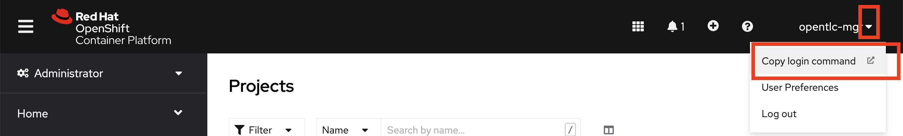

We need Strimzi operator version 0.26 - which is a slightly older version than the latest.
### NOTE - Strimzi needs to be installed before Open Data Hub (ODH) operator (which we'll do next)
Install Strimzi 0.26 as follows.
1. On to OpenShift, click the *Perspective* dropdown list box
2. Click the *Administrator* perspective\
   OpenShift changes the user interface to the Adminstrator perspective.

Navigate to **Operators > Operator Hub** and type *Strimzi*. Click on the Community oparotor box as shown
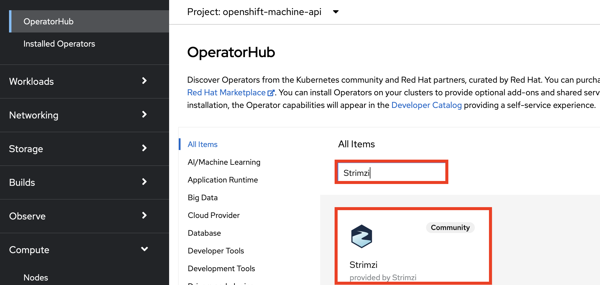

Accept the *Show community Operator* warning. On the next screen go with the defaults and click Install. On the next screen, click **strimzi-0.26.x** and ensure *All namespaces on the cluster (default)* is selected as shown. Then click **Install** on the bottom of the screen
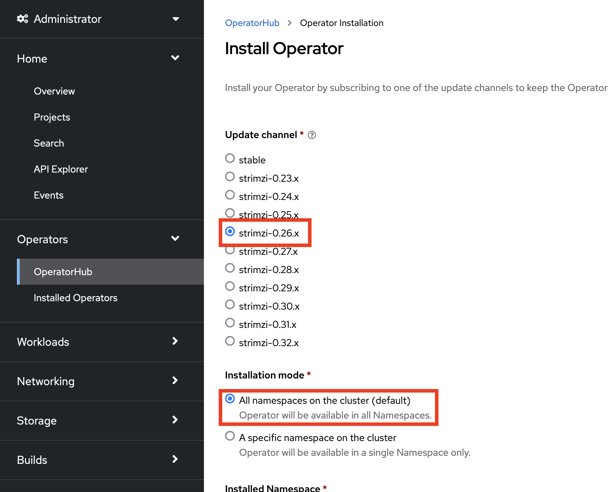

Navigate back to **Operators > Installed Operators**. Notice the *strimzi-kafka-operator* is there but not installed. Click **strimzi-kafka-operator**

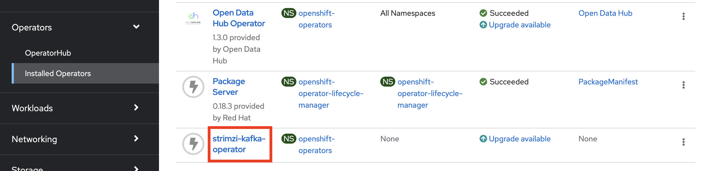

Follow these steps to fully install it
- click **1 requires approval**  
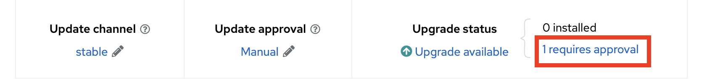

- on the next screen, click **Preview Install Plan**
- on the next screen, click **Approve**

Within a few seconds Strimzi operator version 0.26x will be installed. 


## Install the Open Data Hub Operator version 1.3 cluster-wide

The latest version of the Open Data Hub operatpr is 1.4 at the time of writing. We need 1.3, until various updates are done.
Install 1.3 as follows.

Click the + icon as shown so you can import this yaml pertaining to the ODH operator version 1.3. Paste this yaml in OpenSHift and click **Create**
```
apiVersion: operators.coreos.com/v1alpha1
kind: Subscription
metadata:
  name: opendatahub-operator
  namespace: openshift-operators
spec:
  channel: stable
  installPlanApproval: Manual
  name: opendatahub-operator
  source: community-operators
  sourceNamespace: openshift-marketplace
  startingCSV: opendatahub-operator.v1.3.0
```

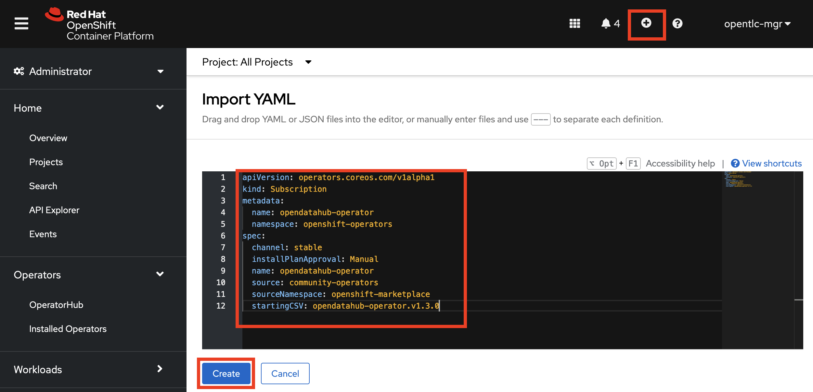


As this is not the latest ODH operator, we need to manually approve it. Navigate to **Operators > Installed Operators**. Ensure All projects is selected under the projects menu. Notice the ODH operator is there but not fully installed. Click on the **opendatahub-operator** link:
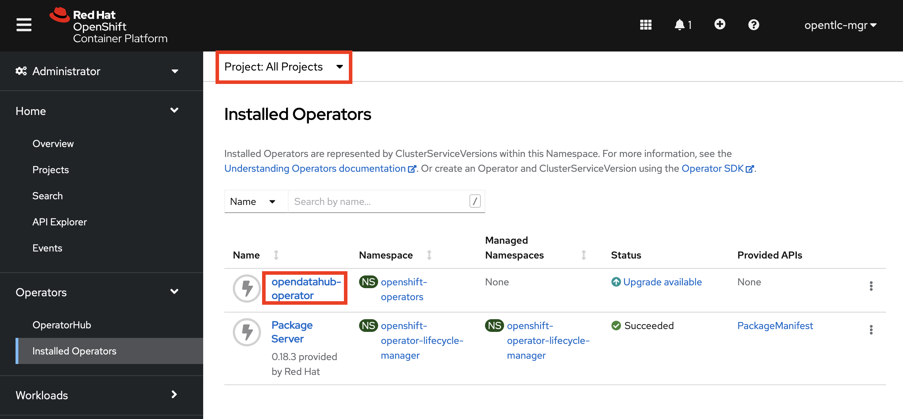

6. Click *1 Requires Approval*
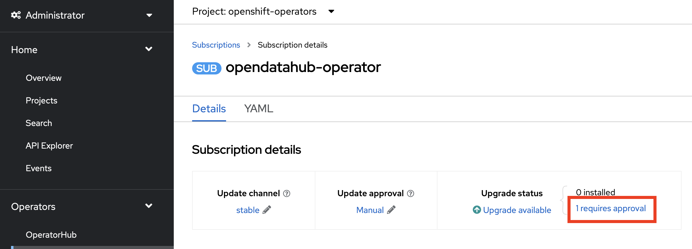

7. Then click **Preview Install Plan**
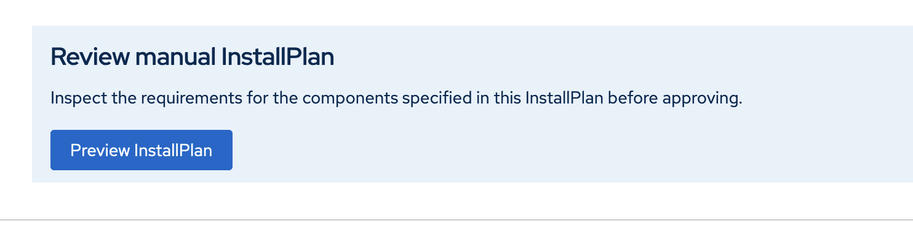

8. Then click **Approve**
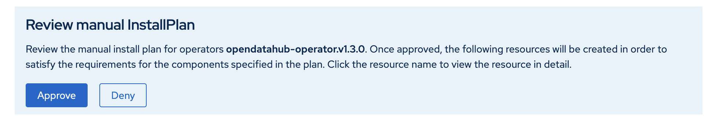

If you move back to **Operators > Installed Operators**, you will see 1.3 is fuly installed within a few seconds. Do not upgrade it.

The Open Data Hub Operator version 1.3 is now installed. 


# Create and select ml-workshop namespace and remove any limits
On your terminal, run this
```
oc new-project ml-workshop
oc delete limits ml-workshop-core-resource-limits
```
This will create our working project *ml-workshop* and delete any resource limits (if they exist - ignore any warnings if no limits exist). 

On the web console, select your *ml-workshop* and navigate to **Operators > Installed Operators**. You should see the correct versions of ODH and Strimzi operators, 0.26 and 1.3, respectively.

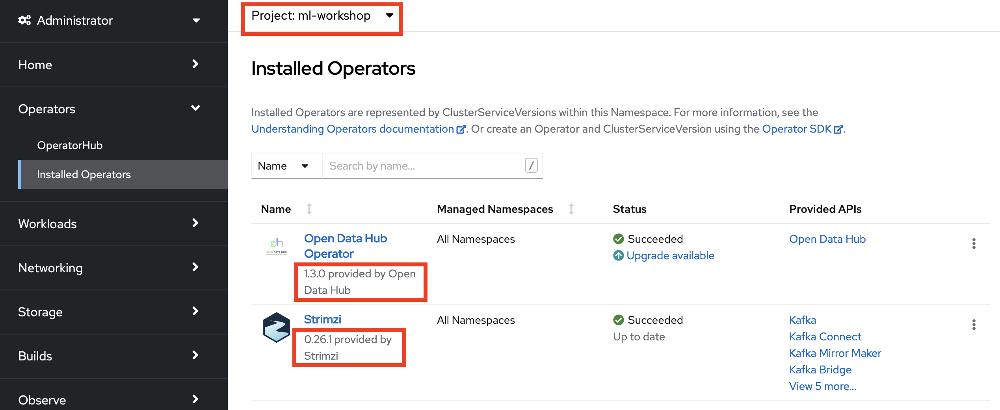

# Install Kafka elements including populate Kafka cluster with product info:
For this we have an openshift manifest. Run the following
```
oc project ml-workshop 
oc apply -f $REPO_HOME/src/deploy/kfdef/workshop-kfdef-kafka-and-populator-ONLY.yaml
```

To verify jobs completed, Navigate to **Workloads > Jobs**. You should see two jobs, which about 3-5 minutes later should show as successfuly completed as follows:


# Install ODH based workshop tools
In a text editor or IDE, open the file ***$REPO_HOME/src/deploy/kfdef/workshop-kfdef-WITHOUT-kafka-and-populator.yaml***
You need to make one change to it. 
- Locate the **airflow2** overlay in the code  
     
   Around line 57 you will see a **value** field that contains part of the URL to your OpenShift clister.  

- Using the example above, replace the value with the the URL of **your** cluster from the *.apps* through to the *.com* as follows (your URI will be different to this example)

- Save the file

Now run the following:
```
oc project ml-workshop 
oc apply -f $REPO_HOME/src/deploy/kfdef/workshop-kfdef-WITHOUT-kafka-and-populator.yaml
```
Note: This installation will take several minutes to complete.

## Installation Complete
The installation phase of Open Data Hub is now complete. Next you will configure the workshop environment.

--------------------------------------------------------------------------------------------------------

# Workshop Configuration

### Adding users to the workshop
If you are running ODH for a a workshop then you need to configure the users. If you are using the environment as a demo then you can jump forward to the **Configure Tools** section.

1. In a terminal window, type the following commands:
```
cd $REPO_HOME/src/deploy/scripts
./setup-users.sh
```
   <span style="color:yellow">**Note: This script sometimes generates errors creating the users. Need to revisit this and fix it. Just run it twice in the meantime.**<span> 

After this script, both **_opentlc-mgr_** and **_user29_** have cluster-admin access.

If you need to create users with different credentials consult [this blog](https://medium.com/kubelancer-private-limited/create-users-on-openshift-4-dc5cfdf85661) - on which these instructions are based.

The password for all users is **openshift**.

--------------------------------------------------------------------------------------------------------

## Allocate sufficient compute and memory resources for the workshop

This workshop is based on a standard RHPDS OpenShift configuration that at the time of writing is:   
| Purpose | Qty | vCPUs | Memory  |
|---------|-----|-------|---------|
| Master  | 3   | 4     | 16GiB   |
| Worker  | 2   | 16    | 64GiB   |

This workshop is resource hungry - especially the Data Engineering section. 

In order to ensure that the workshop has adequater capacity, adjust the cluster's number of workers accordingly: **For every 10 users, we suggest adding three additional  nodes to your cluster** each with the following capacity:
- 16vCPUs and 64 GiB Memory

For example, a workshop with seven users should have:
| Purpose | Qty | vCPUs | Memory  |
|---------|-----|-------|---------|
| Master  | 3   | 4     | 16GiB   |
| Worker  | 5   | 16    | 64GiB   |

If you're on AWS, this exact size of machine is available with machine __m5a.8xlarge__.  

### Review the Existing Cluster Capacity

Using the OpenShift Administrator perspective:   

1. Click: **Compute > Nodes**   
   Observe the number of worker nodes   

   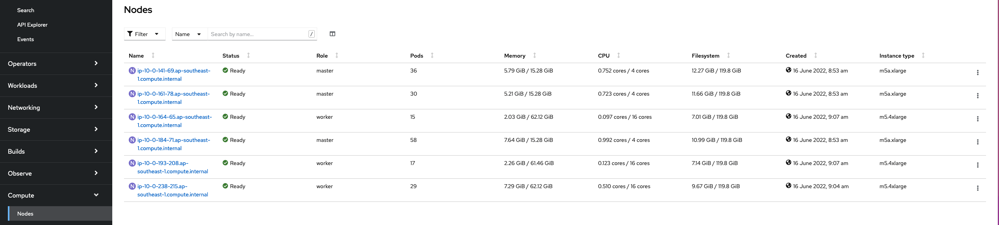   

2. Calculate the number of additional worker nodes according to the guidelines provided above.   
3. Click **Compute > MachineSets**   

   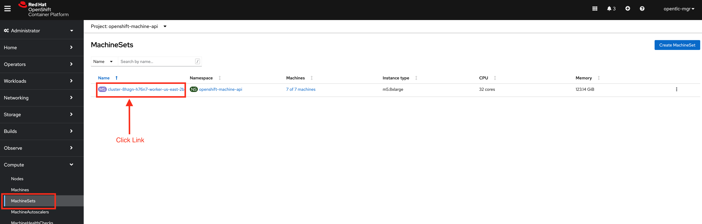 

In this example there is I have two MachineSets of type _m5.4xlarge_. (yours may be different)
4. Click the MachineSet link.   
   OpenShift displays the MachineSet's details.

   <span style="color:yellow">**Note: Fix the screen shot. This has m5.8xlarge.**<span> 

5. Click **YAML** in the *MachineSet Detail toolbar*.  
   OpenShift displays the YAML editor for the MachineSet   

   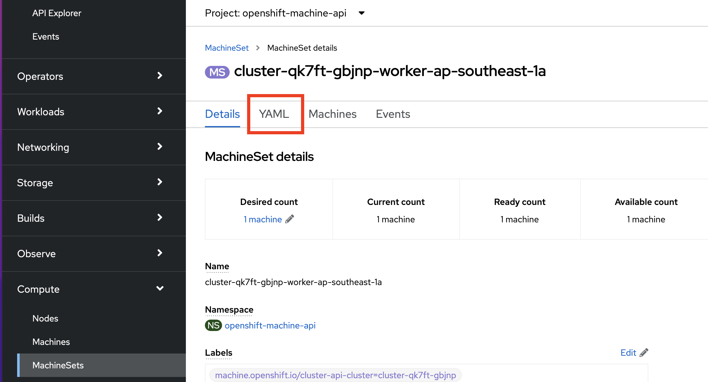 

6. Locate the *instanceType* property under the *spec* section
7. Replace the instanceType value with m5.8xlarge

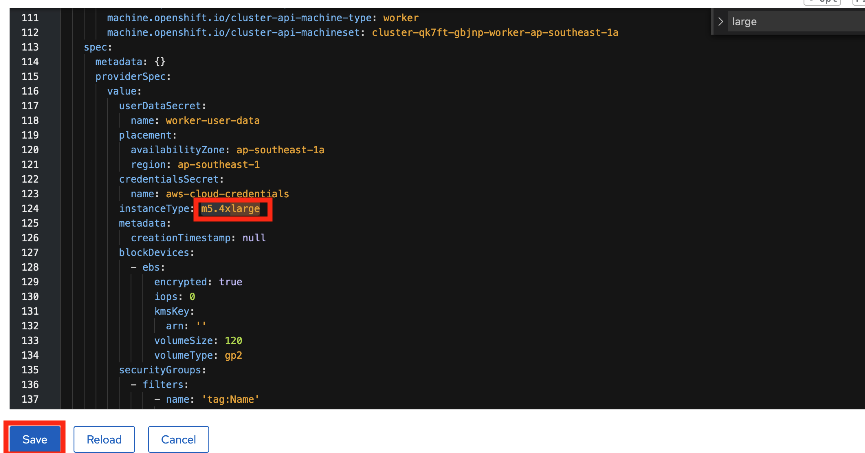 

8. Scroll to the bottom of the web page and click **Save**   
   OpenShift saves the MachineSet config and displays the MachineSet details

9. Click the **Actions > Edit Machine Count** drop-down button on the top right of the screen   .
   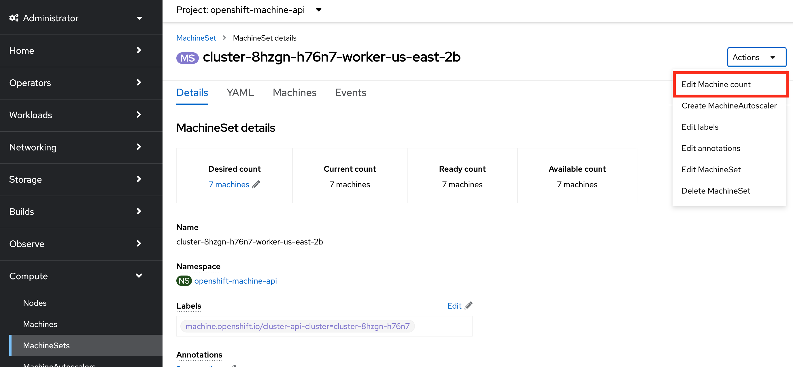 

10. Adjust the machine count to be the desired value and click **Save**.   
    OpenShift will start adjusting the worker node count to the desired number of machines. This process can take some time **(you'll need to wait 5-10 minutes before your new nodes are available)**.  
    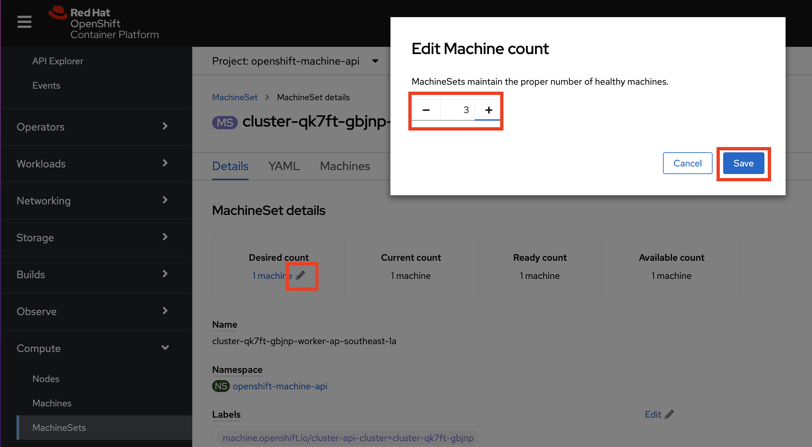 

Validate the machines are provisioned.
11. Click **Compute > Nodes**
    Observe the machines as they are provisioned and come online.

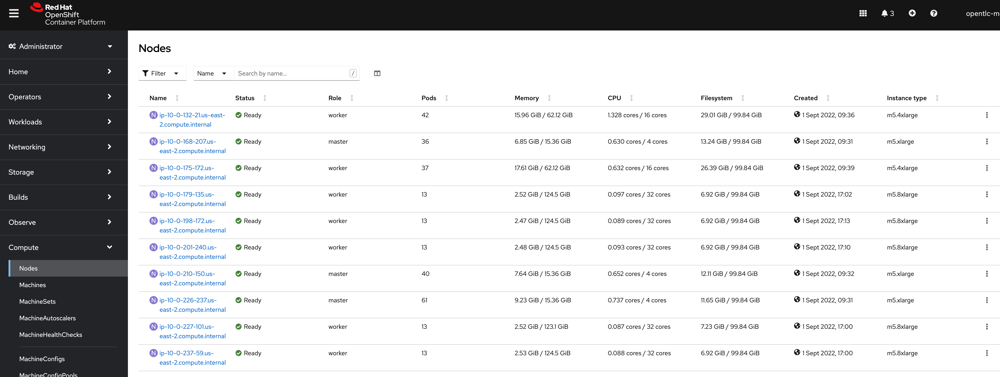 


Increase your node count accordingly if you have more workshop users. (Bear in mind we do find limiting the participant count to 20 makes the lab more manageable)


   <span style="color:yellow">**Note: Be sure to scale back down your machine count following the workshop, so you're not overconsuming resources - and costs!.**<span> 

--------------------------------------------------------------------------------------------------------

## Configure the S3 Storage

### Upload File to the rawdata Bucket

In this section we will upload the files that will be used for feature engineering. The files are located in the **data-files** directory in the ml-workshop git project you cloned earlier.

1. Open the OpenShift console in your browser.
2. Click: **Networking > Routes**  

     

3. Scroll down to find *minio-ml-workshop-ui*. 
4. Click the Minio url under **Location** heading  
OpenShift opens a new browser tab and launches the Minio console and diaplays the login screen.   
   

5. Enter the following credentials:  
* Username: **minio**
* Password: **minio123**
6. Click **Login**  
Minio displays the main console and all of the existing S3 buckets.  
   

7. Scroll down to find the *rawdata* bucket.
8. Click **Browse**.  
Minio displays the bucket contents.  

You will now upload a folder (**customers**) to the *rawdata* bucket.

### Upload the *customers* data

9. Click: **Upload Files > Upload Folder**  

     

Minio prompts for the folder to upload.

10. Navigate to the data files directory within the git repository
  ```
  $REPO_HOME/data-files
  ```
11. Click the **customers** folder.   
    

11. Click: **Upload**.  
Minio uploads the folder and all file contents to the *raw data* S3 bucket.

12. Click the **Clean Complete Objects** button  to reveal the hidden upload controls. 

--------------------------------------------------------------------------------------------------------

## Configure Superset

Now you need to set up Superset to talk to our S3 and Kafka raw data via Trino - exposing the data via SQL.

1. Open the OpenShift console in your browser tab.  
     

2. Click the url for *superset*  
   OpenShift opens a new browser tab and displays the Superset login page.   
     

5. Enter the following credentials:   
* Username: **admin**   
* Password: **admin**   
6. Click **SIGN IN**  
   Superset diaplays the main console.  
     

7. Click: **Data > Databases**  
   Superset displays a list of configured databases.  
     

8. Click: the **"+ DATABASE"** button  
   Superset prompts for the database connection details
     

9. Click the **Supported Databases** drop-down list
10. Scroll down to the entry **Trino** and click it.
11. Copy and paste the following text into the **SQL Alchemy URI** text box:
```
trino://admin@trino-service:8080
```
12. Click **Test Connection**.  
If all steps have been performed correctly, Superset displays the message **Connection looks good!**.
     

13. Click the **Advanced** tab in the **Edit Database** form.  
Superset prompts for the advanced database configuration.   
     

14. Click **SQL Lab**.
15. Complete the form as illustrated in the following figure:  
     
16. Click **CONNECT** (or **FINISH** if you have done this step previously)\
    Superset saves the connection details and displays the main console
17. Click **SQL Lab > Saved Queries** in the main toolbar.   
     

18. Click the **+ QUERY** button.

<span style="color:yellow">*NOTE: **DO NOT SAVE THE QUERY**. We don't save this as it only needs to be run once per workshop*</span>

19. Copy and paste the query editor:   
      ```
      CREATE TABLE hive.default.customers (
      customerId varchar,
      gender varchar,
      seniorCitizen varchar,
      partner varchar,
      dependents varchar,
      tenure varchar
      )
      WITH (format = 'CSV',
      skip_header_line_count = 1,
      EXTERNAL_LOCATION='s3a://rawdata/customers'
      )
      ```

20. Click **Run**.  
   Superset displays *Result - true* as shown.  
     

21. Replace the SQL command with:  
      ```
      SELECT customers.gender, customers.seniorcitizen, customers.partner, customers.dependents, customers.tenure, products.*  
      from hive.default.customers customers,
      customerchurn.default.data products
      where cast(customers.customerId as VARCHAR) = cast(products.customerId as VARCHAR)
      ```   
   Run the query as shown. You should see a resultset spanning personal and product consumption customer data.  
     

22. Click the  button .   
Superset displays the Save As dialog box.

23. Click the **Name** text box. Replace the text with: **Kafka-CSV-Join**


22. Click the **SAVE** button .


--------------------------------------------------------------------------------------------------------


### Install Front End Inferencing web page

Install the application that workshop participants will use to test their models.

1. Change to the **Developer Perspective.**
2. Click **+Add**
3. Click the **Container images** tile  
   OpenShift displays the **Deploy Image** page.  

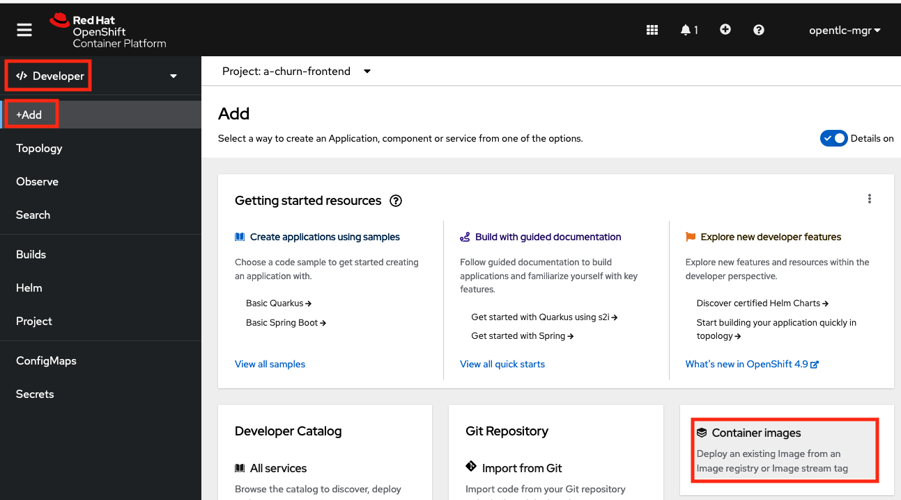 

We've built a container and pushed it to Dockerhub under this repository tag __tnscorcoran/churn-frontend:latest__

1. Type ```tnscorcoran/churn-frontend:latest``` in the **Image name from external registry** text box.
2. Select ```Create Application``` in the **Application** dropdown list
3. Type ```churn-frontend``` in the **Application name** text box. 
4. Type ```churn-frontend``` in the **Name** text box.
5. Click ```Deployment``` in the **Resources** 
6. Select ```8080``` in the **Target port** dropdown list.
7. Click the ```Create a route to Application``` check box.
8. Click ```Show advanced Routing options```  
   OpenShift displays the Advanced routing options.  
   a. Type ```/churn-frontend.html``` in the **Path** text box.
   b. Click the ```Secure Route``` checkbox to **unselect the option**
   c. Leave all options and fields as their other defaults 
9. Click **Create**

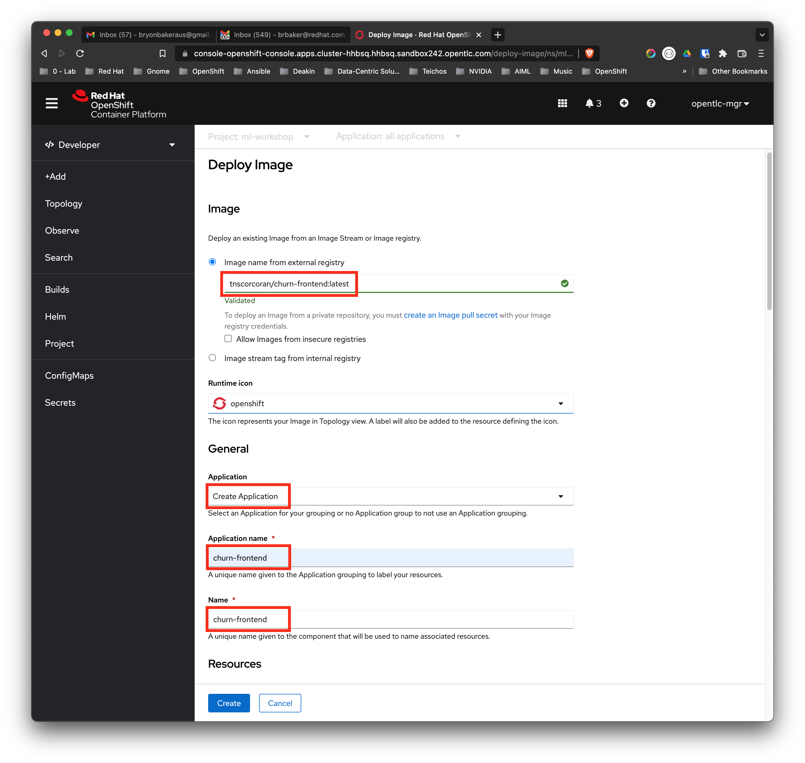  

Scroll down to reveal the rest of the form:  

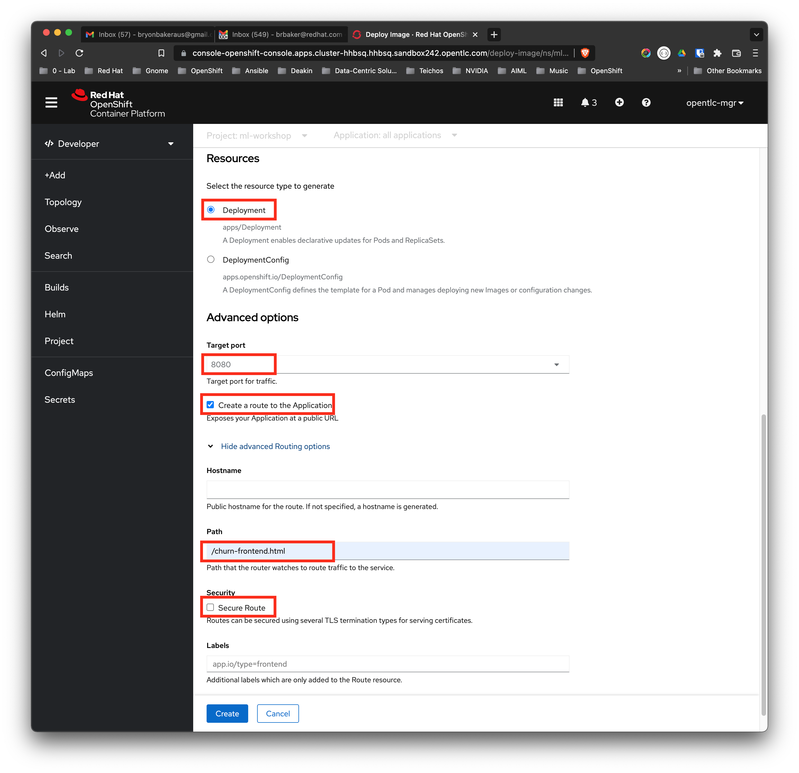  

After a brief period the circle around the Dpeloyment should be dark blue - indicating it's deployed. 

### Test you can access the application.

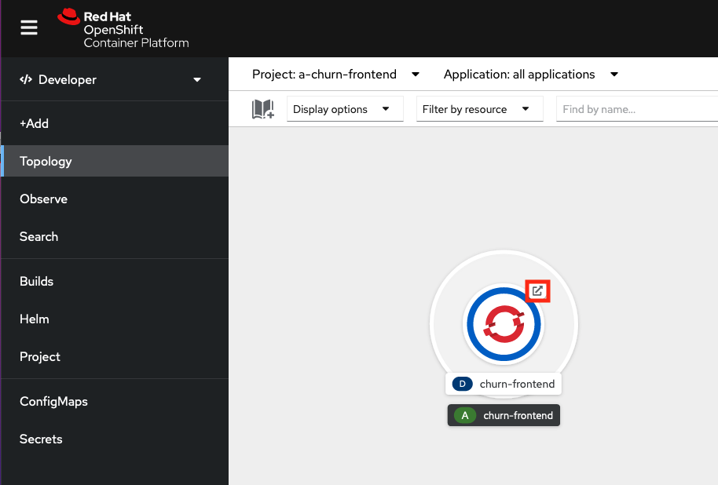  

1. Click the arrow on the Deployment to open the route in a new broiwser tab.  
   OpenShift launchs the Churn Applciation

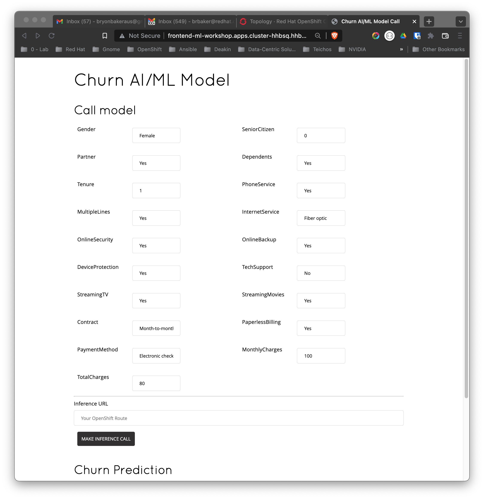  

**Note:** If you get a 404, or 503, change the protocol from HTTPS to HTTP.

# Setup Complete

You are now done with setup!
