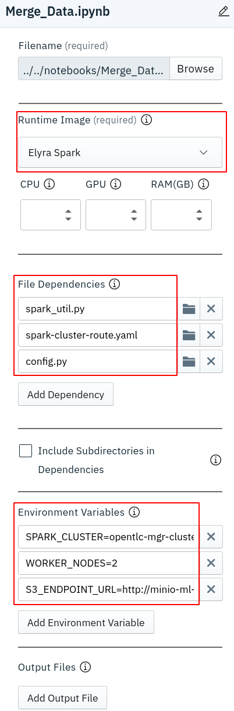

# Lab 1 - Data Engineering

## Introduction 

The Open Data Hub exposes a data-focused tool - for Extract Transform
Load (ETL) of data originating in multiple data sources, i.e. Apache
Spark. Spark allows fine-grained ETL control, e.g. using Regex to match
data patterns. Spark provides a further toolset to allow data
professionals to prepare quality data for consumption by data scientists
and AI models.

This diagram illustrates the workflow we're implementing - the beginning
part of the overall AI/ML workflow:

You can see, we source raw data from Kafka and S3 object storage. We use
Jupyter notebooks to do some simple data engineering - combining these
datasets on customerId using Spark. We then push that prepared data (a
CSV file) to another bucket in our S3 object store, called Minio.

We also introduce a new level of autonomy and control - automation and
scheduling of this task - using the workflow scheduling and management
tool - Apache Airflow. You'll see this is very simple - democratising
activities that used to be the realm of DevOPs specialists.

## Access the OpenShift environment

Your instructor will provide you with a username, password, and link to
access your environment. Using your browser and the URL provided by the
instructor:

1.  Open the url provided by your instructor.  
    OpenShift displays a login page.

2.  Enter the credentials your instructor provided and click **Log in**.\
    OpenShift displays the main console.

**Note:** Throughout these labs, you will be asked to select either the **Developer** or **Administrator** perspectives to perform the lab steps. To change the perspective, click the Perspective dropdown menu in the top left of the console, then click the perspective you need to use.

Change to the Developer perspective.

3.  Click the **Administrator** dropdown list box in the sidebar.

4.  Click **Developer**.\
    OpenShift displays the Developer perspective.

Open the project you will use in the workshop:

5.  Click **All Projects** in the console title bar.
   
6.  Type **ml-workshop** in the *project-name* text box.\
    OpenShift filters the list of available projects as you type.

7.  Click **ml-workshop** from the drop-down list.\
    OpenShift opens the ml-workshop project.

Open Data Hub was deployed prior to this workshop. Explore all the components that make up the Open Data Hub suite of applications

8.  Click Topology in the OpenShift sidebar\
    OpenShift displays the project Topology. Observe all the pods for the different applications that make up OpenData Hub.

**You have now completed accessing the lab environment. Proceed to the next section.**

## Instructions for the Spark workshop

Change to the **Administrator** perspective:

1.  Click the **Perspective** drop-down list in the top left of the console.

2.  Click **Administrator**.

The OpenShift console displays the **Administrator** perspective.

Open a second browser tab with the same URL for the OpenShift console.

(If you are using Google Chrome you do this by:)

1.  **Right-click** the OpenShift browser tab.

2.  Click **Duplicate**.

We will refer to these as **tab 1** and **tab 2** in the instructions
below.

**In Tab 1**

3.  Click **Workloads** Pods.\
    OpenShift displays a list of all pods running in the ml-workshop project.

4.  Click the **Filter** text box.

5.  Enter your username\
    OpenShift removes all (or almost all) of the pods so you only see the pods related to you.

Open Jupyterhub using the second tab.

6.  Open **Tab 2** in your browser

7.  Verify that you have the **Administrator** perspective selected.

8.  Click **Networking \> Routes**.

OpenShift displays the external network routes to the applications in the ml-workshop projects. These routes are how you open the console for each application in Open Data Hub.

Filter the URLS to locate Jupyterhub

9.  Type *Jupyterhub* in the **Search by name** text box.

10. Click the route in the **Location** column

OpenShift launches a new browser tab for Jupyterhub and prompts you for a username and password.

11. Enter the same credentials your instructor gave you to log into OpenShift\
    OpenShift prompts you to authorise Jupyterhub to access your account credentials

 

12. Click **Allow selected permissions**. \
    OpenShift prompts you to select the Jupyter Notebook image and image size.

 

13. Click **Elyra Notebook Image with Spark\
    Warning:** Please make sure you select the correct notebook image, otherwise the lab will not work.

14. Click the **Container size** dropdown list box and click **Large**.

15. Click **Start server**.

OpenShift starts a new Jupyterhub notebook server for your lab environment.

 

During the provisioning of your notebook OpenShift has also created a
Spark cluster for your dedicated use.

16. Open browser **Tab 1**\
    OpenShift displays the pods associated with your username. Observe
    the Jupyter notebook pod and the new spark cluster pods.

 

**Using JupyterLab**

17. Open the **JupyterLab** browser tab you started earlier.\
    After a few minutes, Jupyterhub displays the notebook.

 

**Copy notebooks**

The workshop requires you to copy some notebooks from a repository.

18. Do the following in this order - as shown below:

    a.  Click the **Git icon**
     on the left toolbar.\
        JupyterLab prompts you to select a repository.

    b.  Click the **Clone a Repository** button

    c.  Enter: **https://github.com/odh-labs/ml-workshop** in the URI textbox

    d.  Click **CLONE**.

Jupyterhub clones the git repository that has all the code you will be
using for this lab.

The **Notebook Explorer** is updated to show the workshop files.

 

19. Note: If your explorer has not updated click the **Refresh or Reload** in your browser

 

Open the folder containing the notebooks for this workshop.

1.  Navigate to the directory **ml-workshop/src/notebooks** in the File Explorer by double clicking each directory.\
    OpenShift displays all of the notebooks you will be using in this lab.

 

**The code used in this workshop is generic to everyone. Before we get
going, you need to make some small changes to the code that are unique
to your user.**

21. Open **config.py**\
    JupyterLab displays the code editor

 

22. Replace **user123** with your username that you are using for this lab (the same one you used to log on to OpenShift). \
\
**Note:** Be careful to enter the correct user name or you will clash with other students. In the example below we have used *user29* Your user will be different.

> user_id = "\<your username\>"

**Save your work**

1.  Click the **Save** icon as shown to save your work.

 

**Prepare the Data**

Now you have set up all the code, you are able to merge the data that
you will use for feature engineering. The first step is to merge the two
datasets.

24. Double-click the **Merge_Data.ipynb** notebook to open it.\
    Jupyterhub opens the **Merge_Data** notebook. This notebook is used by the Data Engineer to prepare the data.

**The Structure of a Notebook**

Notebooks are valuable tools in data engineering and science because
they combine code, documentation, and results into a single artefact
that can be readily shared. In these notebooks you will see a Markdown
section that documents the small code cell immediately under it, and
when the cell executes you can view the result just in time and just in
place.

As you step through each cell, take the time to read its documentation
so you get an understanding for what it is doing.

**Run the notebook**

25. Scroll to the top of the notebook.

26. Click inside the first code cell.

 

27. Press the **SHIFT+RETURN** keys on your keyboard to execute the code
    > in the cell.\
    > JupyterLab runs the code in the call and displays any output.

 

Step through each cell one by one so you can see what is going on.

28. Repeat the previous step to execute each cell in turn.\
    Observe that when a cell completes executing:

-   It is given a sequence number.

-   Any output is displayed immediately under the cell.

 

**Note:** If you want to run the entire notebook click:\
**Kernel > Restart Kernel and Run All Cells** in the toolbar menu.

At a high level, this is what is happening in the most important cells:

 

1.  *pip install xxxx*, installs various libraries that aren't already installed in our notebook image

2.  import the python libraries we need

3.  *watermark* outputs the versions of various components, libraries, operating system attributes etc.

4.  Here we load the user specific parameters - based on the username you entered in config.py

5.  Here we create a Spark session, a precursor to firing up our own Spark server.

6.  Here we set up various environment variables, including connection access to our S3 object store, in our case implemented using the open-source component Minio.

7.  Here we actually start our Spark server. This cell can take several minutes to start.

 

8.  Here we pull in our data from S3 - our CSV based demographic data for each of our approximately 7000 customers.

9.  Note - we are upgrading our demo and workshop. Kafka will be available shortly for the second half(side) of the data set. For now, both halves of our dataset comes from CSV files in S3 object storage

10. Commented out Kafka connection code - ignore for now

 

11. We join these 2 datasets, on the common column to each: *customerID*.

12. We push our data to our object store - filename contains our username.

13. We are all done now - we stop our Spark server.

14. Signal that we're done - and the notebook has run successfully

This completes the first part of the Data Engineering experience.

In this simple exercise that leverages the same tools that you would use
for the most complex data engineering tasks.

Later in this workshop you will automate this Merge-Data task in a
pipeline and store the results S3 object storage.

# Automating and Scheduling Data Engineering Workflows

Next, we introduce a new level of autonomy and control to the data
engineer - automated running and optionally scheduling of the Merge Data
notebook. As a data engineer, you've built a data pipeline (merge-data)
that merges customer data from 2 data sources. But:

-   How do I run it with production workloads?
-   How do I schedule it to run - overnight, every day or every week etc.?
-   How do I ensure this pipeline works right across the ecosystem?

That's where a tool called Airflow comes in. With Airflow:

-   you can automate the running of your notebook - and run it anywhere, or scheduled any time
-   the same IDE (Jupyter Hub in OpenShift) can be used to develop and create the automated data pipelines

Let's get started

## Lab Steps

1. Using the JupyterLab Explorer, navigate to the directory:\
    **/ml-workshop/src/automation/deploy_spark_jobs/**
2. Double click **spark-demo.pipeline**
   Jupyterlab opens the pipline.

   
   
*Observe that the GUI is like a canvas. Each component in the pipeline can be dragged onto the surface, wired up and configured from this GUI - which we'll do later.*

The next thing we need to do is set up an Apache Airflow runtime.\
    Before we do that we need to get the value of your *Airflow Route URL*.

3. Select browser **Tab 1**
4. In the OpenShift Explorer panel navigate to **Networking > Routes**
5. Filter by the name ***ap-airflow2*** as shown.\
   Observe the URL link to the Airflow console in the **Location** column.
6. Copy this URL to your clipboard.

   

Switch to JupyterLab in browser **Tab 3**

7. Click on the **Runtimes** icon  on the toolbar shortcuts\
    JupyterLab displays the Runtimes Explorer.
8. Click on the **+** icon at the top of the **Runtimes Explorer**
9. Select **New Apache Airflow runtime**

   
 

10. Fill the form in as follows:
Name: **UserXX** Airflow runtime [^1]\
Apache Airflow UI endpoint: your \<**Airflow Route URL**\> retrieved above\
Apache Airflow User Namespace: ml-workshop\
Github API endpoint: [[https://api.github.com]{.underline}](https://api.github.com) \[
**footnote** [^2]\]\
Github DAG Repo: airflow-dags/dags \[ **footnote** [^3]\]\
Branch: main\
Github Personal Access Token: *Note: your administrator will give you this during the workshop.
\
\
**Cloud Object Storage Endpoint details:**\
[[http://minio-ml-workshop:9000]{.underline}](http://minio-ml-workshop:9000) [**footnote** [^4]\]\
The Cloud Object Storage Username minio\
The Cloud Object Storage Password minio123\
Cloud Object Storage bucket name airflow

As shown here:

   

11.  Click **Save and Close**

### Configure Python Runner

12. Click the **Runtime Images**  button in the toolbar shortcuts.
13. Click on the **+** icon at the top of the **Runtimes Images Explorer**
14. Complete the form as per the illustration below.

Name: Airflow Python Runner\
Image Name: quay.io/ml-aml-workshop/airflow-python-runner:0.0.8\
Image Pull Policy: IfNotPresent

***as shown here:***

   

  15. Click **Save and Close**
  16. Click **Runtime Images**  
  17. Click **+** and complete the form as per the illustration below.

Name: Elyra Spark\
Image Name: quay.io/ml-aml-workshop/elyra-spark:0.0.4\
Image Pull Policy: IfNotPresent

as shown
   

  18. Click **Save and Close**
  19. Click the **File Browser**  button in the toolbar shortcuts so you can access the rest of the project files.
  20. Click the **spark-demo.pipeline** tab in JupyterLab to open it

   

Each component in the pipeline can be configured from the pipeline GUI -
which we'll do now beginning with the start-spark-cluster element of the
pipeline.

  21. Refresh your browser web page
  22. Right-click **start-spark-cluster**  
  23. Click **Properties** \
     
    Selt these values as shown in the screenshot below\
    \
  **Runtime Image:** Airflow Python Runner (note if *Airflow Python Runner* is not visible, refresh your web page)

  File Dependencies:
  - spark-cluster.yaml
  -  spark_util.py
  -  spark-cluster-route.yaml

  Environment Variables
  - SPARK_CLUSTER=**userXX**-cluster
  - WORKER_NODES=2
  - S3_ENDPOINT_URL=[[http://minio-ml-workshop:9000]{.underline}](http://minio-ml-workshop:9000)

  Output Files
  -  spark-info.txt

 As shown here:
   

-   Save your work by clicking on the **Save** button  

Repeate the above steps for Merge_Data:
24. right-clicking and filling as follows:

-   Complete the form as illustrated in the screenshot below

  Runtime Image:
  - Elyra Spark

  File Dependencies
  - spark_util.py
  - spark-cluster-route.yaml
  - config.py

  Environment Variables
  - SPARK_CLUSTER=**userXX**-cluster. \
    Replace **userXX** with your username and ensure your cluster has 2 worker node
  - WORKER_NODES=2
  - S3_ENDPOINT_URL=[[http://minio-ml-workshop:9000]{.underline}](http://minio-ml-workshop:9000)

   

25. Save your work by clicking on the **Save** button  

26. Finally, do the same with stop-spark-cluster - which has fewer still values\
   

-   Save your work by clicking on the **Save** button\
   

**Run Pipeline**

You can now run your pipeline. Click the Play button as shown. A useful
naming convention is to enter a name in a format beginning with your
username - followed by the month and day and the count of runs that day.
This sends each run to the bottom of the list on the Airflow GUI.

**userXX**-**MMDD**-01-spark, in my case ***user30-0223-01-spark***.
Also choose your Airflow Runtime and Runner as shown:\
 

~~Note - if you get an error that it can't find
***spark-cluster-route.yaml***, in the file explorer on the left
navigate to **airflow/deploy_spark_jobs** and copy
***spark-cluster-route.yaml***. Then navigate to ***notebook*** where
***Merge_Data.ipynb*** is located and paste
***spark-cluster-route.yaml*** there.~~

~~Press Play again. Two pop-ups will show - including this one. OK
them~~

 

Now let's take a look at the Spark job we pushed to our workflow engine
Airflow.

In a browser open your **Airflow Route URL** as described above in step
1.  After logging in with your OpenShift credentials. click DAGs and
you'll be presented with the a page like this:

 

You will see many DAGs, representing previous pipeline runs. Filter on
your username in the right-hand side box to see only yours.

Drill into your Spark job DAG by clicking on it - the one you just ran.
You can see the stages and the success or otherwise of the various
stages in your pipeline.Click on Graph View for a more detailed view

 

Click on the Merge Data stage

 

You have many options to control and re-run stages for example. You can
also view the logs for the stage from here as well\
 

Finally, by clicking **schedule@once** you can schedule this job to run
on a periodic basis - fully automated through cron.

 

Click the blue **+** icon to do this. We'll leave this as an exercise
for you, the user.

 

That concludes our Airflow pipeline and workflow section. Hopefully you
agree this is a very powerful tool - bringing agility and autonomy to
the data engineer!

**Recap and Cleanup**

Before we move on, let's have a look at how OpenShift provisioned a
Spark cluster for you to do your work.

-   Open **Tab 1**.

 

OpenSHift displays all of the pods for your username. Here you can
observe that a Spark cluster was started for the Data Engineering work.
This is an example of the self-service capabilities OpenShift brings to
the table and unlocks the productivity of your team.

We don't need this notebook any more so we will shut it down - along
with the Spark cluster that was created with it. This is another example
of how OpenShift provides efficient use of resources by returning them
to the pool when they are no longer needed.

-   Open the Jupyterhub notebook tab.

-   Click menu item **File \> Hub Control Panel**

 

Jupyterhub displays the server-control page.

 

-   Click **Stop My Server**.

> Jupyterhub commences releasing all of the OpenShift resources.
>
> To watch this in action:

-   Open **Tab 1**

> Observe your Spark pods being destroyed.

 

You can see each of the pods terminating. This is a powerful
demonstration of OpenShift's self service capabilities. No waiting for
IT to provision you a server, no waiting around for access to a scarce
Spark server. All self service, on demand, and those resources returned
back to the central pool when finished.

Congratulations - you've completed the first lab. Now move to the next
one: **AI/ML on OpenShift Workshop - Lab 2 - Data Science.**

[^1]: Replacing **userXX** with you username

[^2]: Note: when you create the pipeline, it doesn\'t get saved to
    Airflow, rather it is saved to Git - to give you versioning etc.

    Then Airflow downloads from Git. Means you need to use a Git repo.

[^3]: For convenience, use our temporary repo setup for workshops:
    [[https://github.com/airflow-dags/dags]{.underline}](https://github.com/airflow-dags/dags)

[^4]: Airflow needs S3 to push logs to
