# Lab 2 - Data Science #

**Introduction** 

Next, we feature three Jupyter notebooks the data scientist uses, pulling the prepared CSV data that the data engineer pushed to S3 object storage in the previous lab:

- They first visualise the data - to understand patterns in the data and whether there are any errors they need to fix before experimenting and training their models.
- They then experiment with different algorithms, parameters and hyperparameters. They push each experiment to the model repository, ML FLow. This repository contains all of the data and the actual model binaries should they wish to
    1. Compare different experiments
    2. Return to and retrieve any experiment they ran
    3. Share their experiments with others. In this way, we’re breaking down silos between different actors in the workflow
- They then choose one of their experiments, which they wish to push to production (in the next part of the workflow, the ML OPs phase)

This diagram illustrates the section we’re implementing - the Data Science part of the overall AI/ML workflow:

 

**Instructions to access your prepared data file from the previous lab**

Now you access the prepared CSV data file you created and pushed to S3 object storage, in the previous lab under the Data Engineer persona.

Login to OpenShift using the credentials your administrator gave you. Ensure your workshop project ml-workshop is selected.

The first thing you need to do is view the file pertaining to your username - which you as a data engineer created previously.  \
Choose the **Administration perspective**

- Navigate to **Networking > Routes**. 
- Filter on _minio_ - and open the _minio-ml-workshop-ui_ route as shown. 
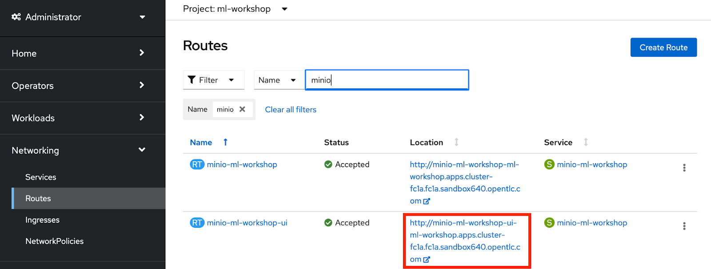 

- Enter the username and password minio / minio123 
 

- Scroll down to the **data** bucket, and click the **Browse**. \
Minio displays a list of folders in the _data_ bucket. The folder-name format is: “_full_data_csv-&lt;your username>_” E.g. For user29 the folder is: _full_data_csv-user29_

 

- Scroll through the list of folders and locate the folder with your username \
**Note**: There may be many folders there - be sure to identify the one containing **your username.**
- Click the folder that corresponds to your username. \
Minio displays the file(s) you created in the Data Engineering lab

 

- Click the file with name starting with “part”:
 

Our workflow has created this file - and as such allows eaiser collaboration and work handoff between the data engineer and the data scientist. It's a powerful capability that breaks down the sileos we often see in AI/ML workflows. 

## Part 1: Visualise Data ##

Now to our Data Science focused Jupyter notebooks. As we did with Minio, we will find the url for Jupyterhub within the routes of the OpenShift console.

1. Open the browser tab with the OpenShift console.
2. Open the **Administrator perspective**.
3. Click **Networking > Routes**. 
4. Type **Jupyterhub** in the **Filter** text box.

OpenShift reduces the list of routes as you type the filter.

5. Click the Jupyterhub link in the **Location** column of the **Routes** display. 
   
 

Because you shutdown your Jupyter server at the end of the last workshop, you’ll again be presented with the Jupyter screen where you choose the base image to work with. As we’re now assuming the role of a data scientist, do the following:

JupyterHub displays the Start Notebook Server page.

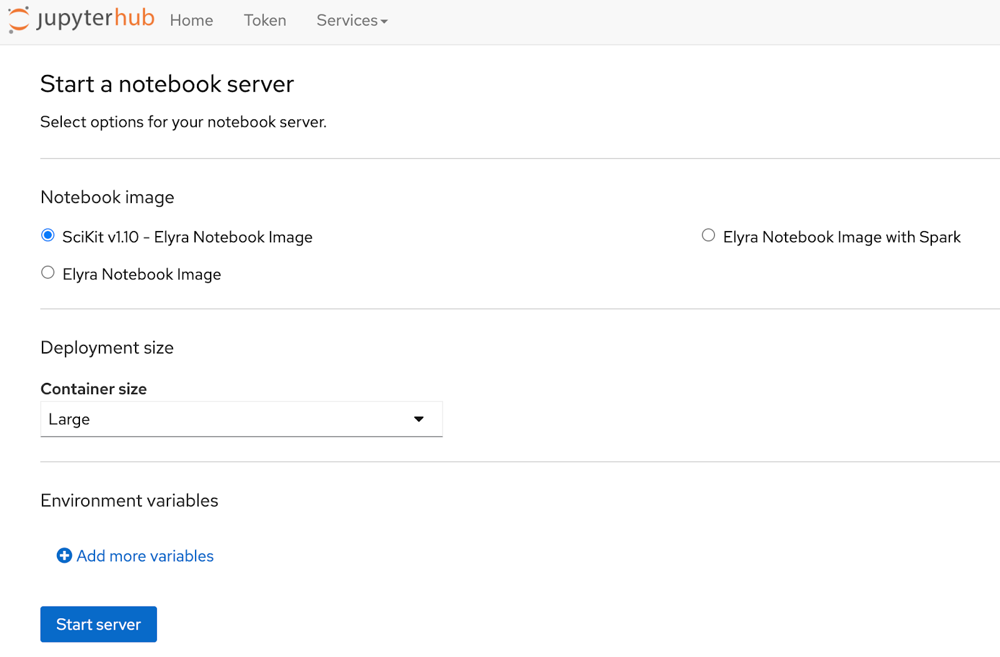 

1. Click **SciKit v1.10 - Elyra Notebook Image**
2. Select **Large**
3. Click **Start Server**.

**Warning:** Please select the correct notebook image, otherwise the lab will not work.

Jupyterhub starts the notebook server for the Data Scientist.

 

After a few minutes the notebook will have started and the Jupyter notebook will be displayed.

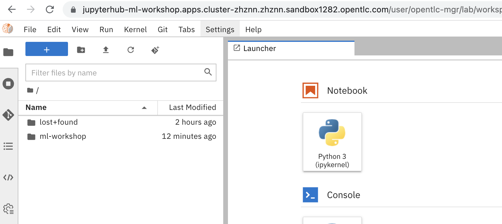 

Observe:
* The same _ml-workshop_ folder we previously pulled down from our GitHub repository \
git clone [https://github.com/odh-labs/ml-workshop](https://github.com/odh-labs/ml-workshop) 

Now to run your first data science notebook, navigate to ml-workshop/src/notebooks/ and open Visualise_Data.ipynb

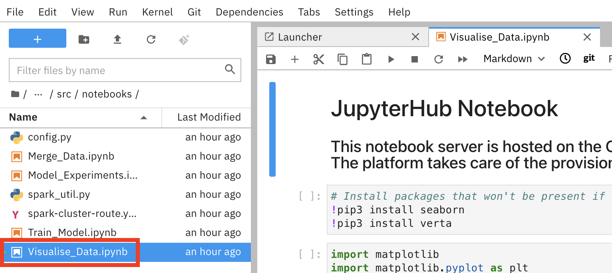 

1.  Scroll up to the top of the notebook
2.  Click in cell **[1]**.

You will now step through the notebook one cell at a time.

12. Type **[Shift] + [Return]** to step through each cell in the notebook.

Now, as previously, select the first cell and walk through each cell executing you go by clicking SHIFT + RETURN.

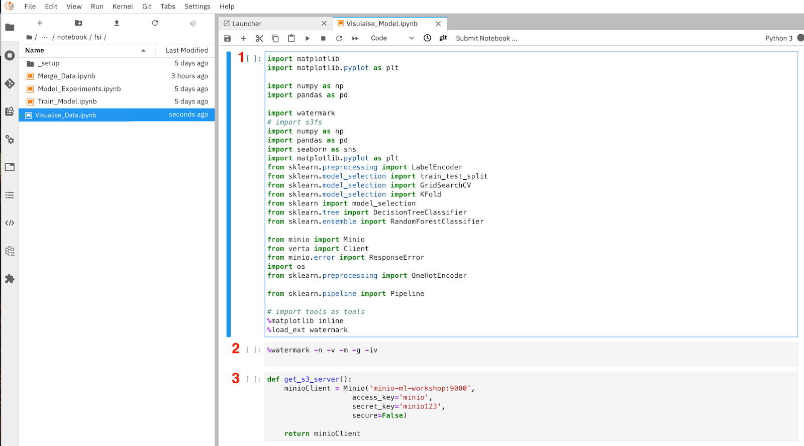 

1. **_pip install_** extra libraries not in our base container image
2. Import our desired Python libraries.
3. _watermark_ outputs the versions of various components, libraries, operating system attributes etc.
4. Here we load our lab parameters - in particular our username and CSV file prepared earlier when we assumed the role of _data engineer_.

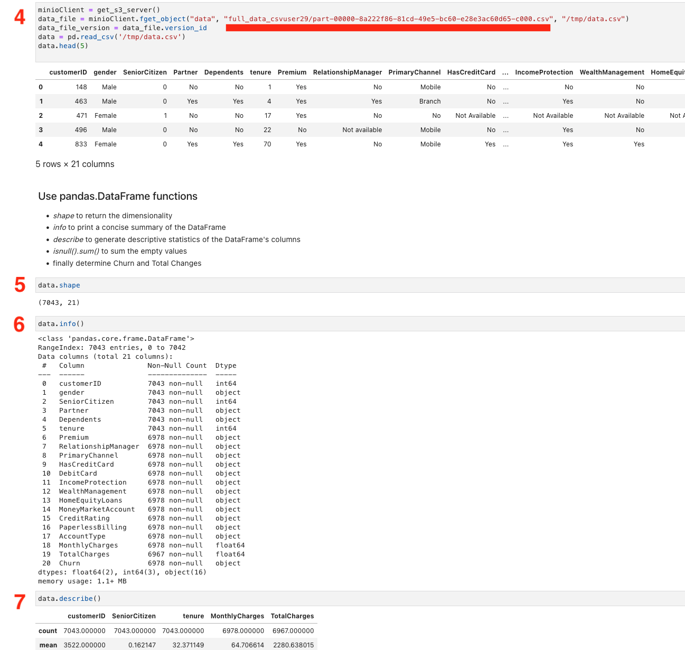 

5. Return our S3 Object store details for retrieval of the CSV file prepared earlier.
6. In this cell we read in the CSV file then output the first 5 lines of the file - so the data scientist can get a quick view of the data.
7. We output the dimensions of the data in rows and columns (features)
8. Here we output various data around the columns (features) including their types, names etc
9. Using _describe(), _we output various statistical data associated with the entire dataset, max, mean etc. values for numeric columns.
10. We output the sum of rows with null values with nulls - to assess data for errors, e.g a null for _charges_ indicates an error.
11. Here we output the total count of the **_labeled_** column, *Churn*. We need a decent spread, and we have it - with just over 2 to 1.
12. Here we make a simple conversion from Yes and  No to 1 and 0, to facilitate plotting.

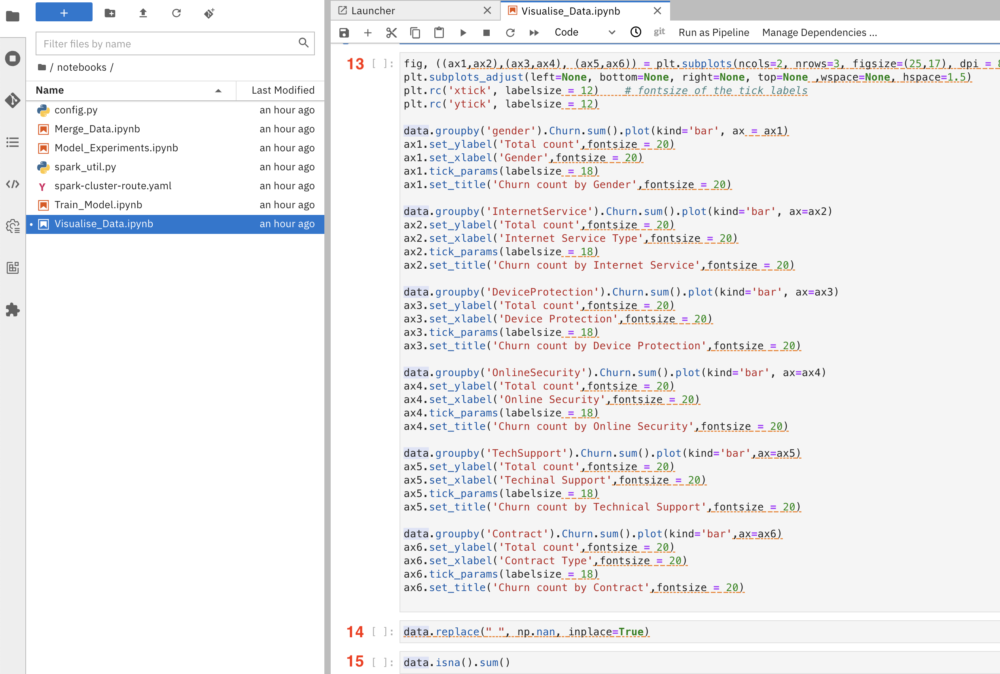 

13.  This cell visually outputs churn count by various features in the data set.
14.  Here we swap NaNs for spaces.
15.  Detect missing values for our features  

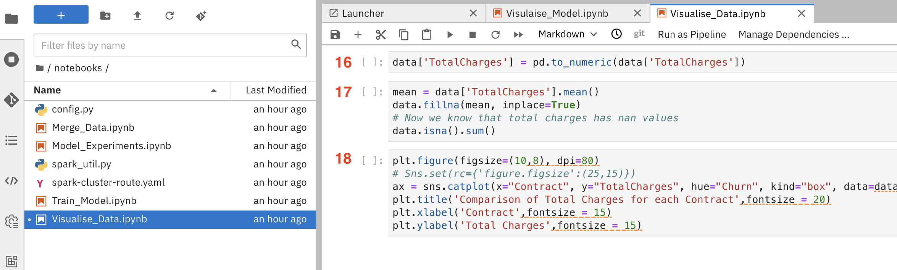 

16.  Convert to numeric.
17.  Fill NANs with the mean
18.  Here we output a box plot - a useful visualization of 2 dimensions by the labeled column _Churn_
    
## Part 2: Experiment with Models ## 

At this point, as a data scientist, we have a good understanding of the data. Now it's time to start experimenting with different models, parameters and hyper parameters.

As we experiment, we want our notebook to create an experiment id for every experiment (which is guaranteed to be unique within our team, as it uses user id and timestamp as a basis). 

This experiment id is then used as an identifier when we push our experiment metadata and binaries to our model repository, ML Flow. In this way, we retrieve and repeat any experiment we have done, as well as share this experiment with other team members, breaking down silos between teams and individuals in AI//ML workflows.

 - Using the File Explorer, open the **Model_Experiments.ipynb** notebook. Jupyterhub opens the code window as shown:

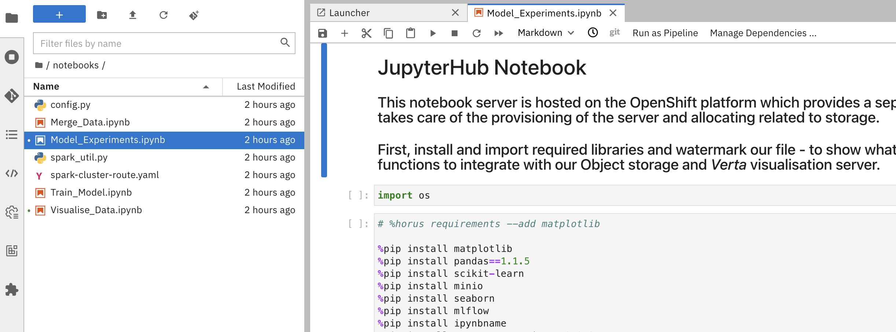 

Next, just as you did in the previous lab you will step through the code one cell at a time.
 - Scroll up to the top of the notebook
 - Click in cell **[1]**.
 - Type **[Shift] + [Return]** to step through each cell in the notebook.

Cell descriptions follow

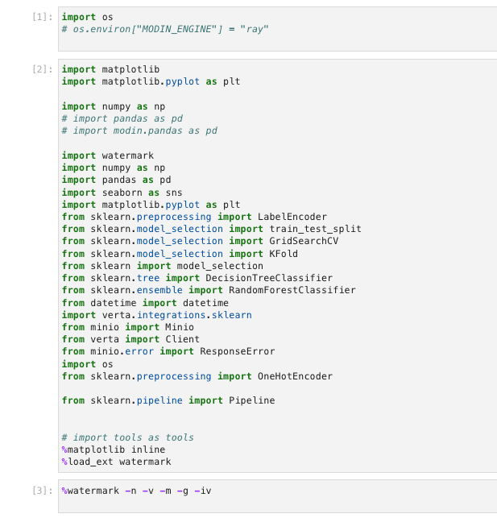 

1. Import required libraries
2. **_pip install_** extra libraries not in our base container image.
3. Import required libraries
   
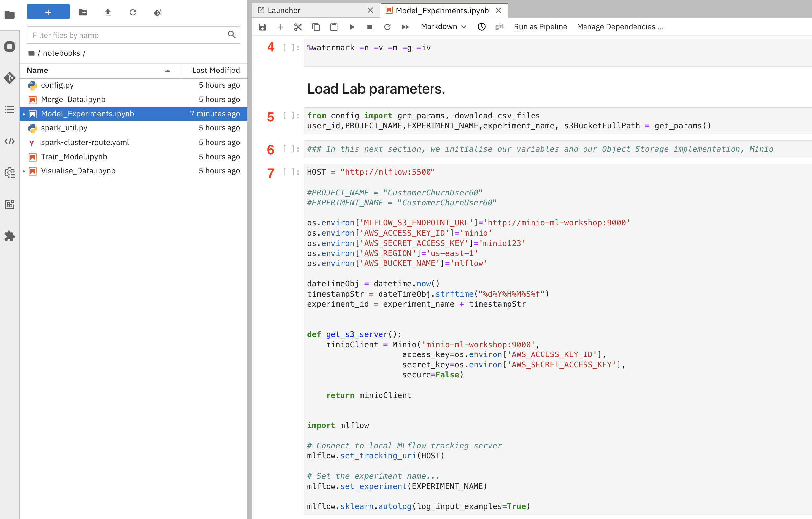 

4. _watermark_ outputs the versions of various components, libraries, operating system attributes etc.

5. Here we load our lab parameters - in particular our username and CSV file prepared earlier when we assumed the role of _data engineer_..

6. n/a
7. Here we add some simple integration code - to allow the data scientist 
   - Retrieve the CSV file prepared earlier data engineer, from Minio S3 object storage
   - Inject their work into the workflow.
  
  The HOST line on top and the 4 lines using ml-flow is all they need to  push all of their experiments to our model registry** Ml Flow**
   
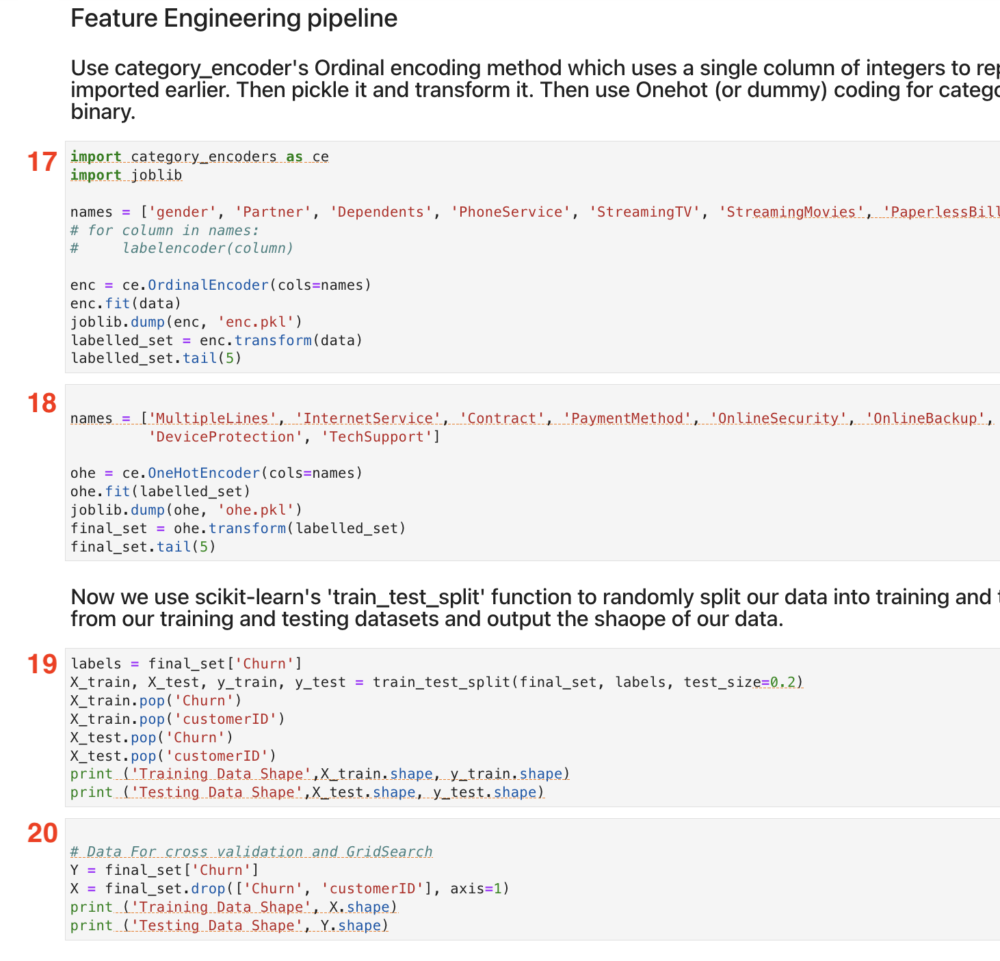 

8. Here we retrieve the CSV we prepared in the Data Engineer lab earlier and output the first 5 lines of the file - so the data scientist can get a quick view of the data.
9. Descriptions of the cells that follow.

Several of the cells after 9 are identical to those in the previous notebook, *Visualise_Data.ipynb*

From here, run all the way down to cell 19, _Feature Engineering Pipeline_.

 

19.  Here we use an Ordinal Encoder to convert simple binary values to a numeric representation. Output the data after applying the Ordinal Encoder.
20.  Here we use a One Hot Encoder to convert multi valued features to a numeric representation. Output the data after applying the One Hot Encoder.
21.  n/a
22.  Here we split our data set into a training and a testing set, and discard unwanted columns customer id and our labeled column Churn.  
23.  Further data set refinement.

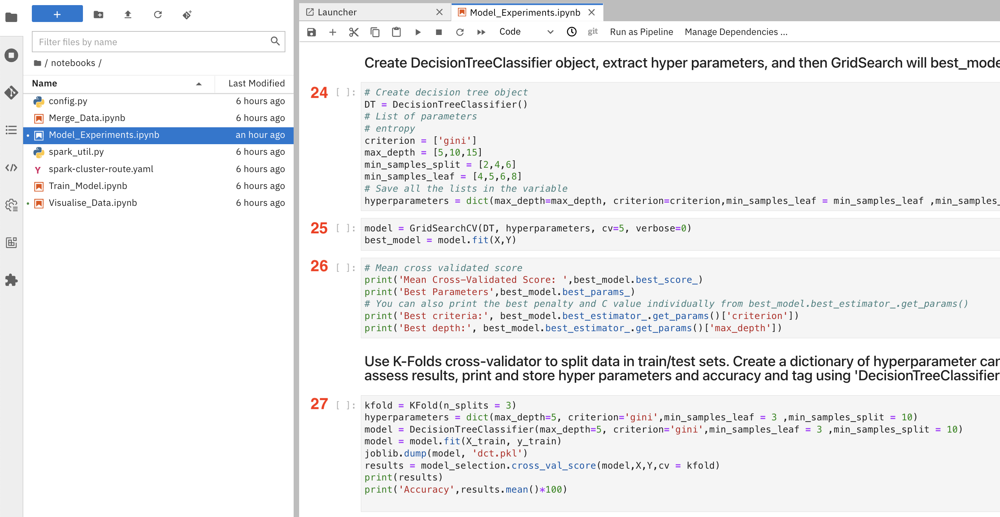 

24.   Create a DecisionTree Classifier with these hyper parameters
25.   Use GridSearch to output the best model / hyper parameters from the combinations supplied to its _fit_ method.
26.   Print out those best model parameters
27.   Use K-Folds cross-validator to split data into train/test sets. Create a dictionary of hyperparameter candidates, train the model using a DecisionTreeClassifier.

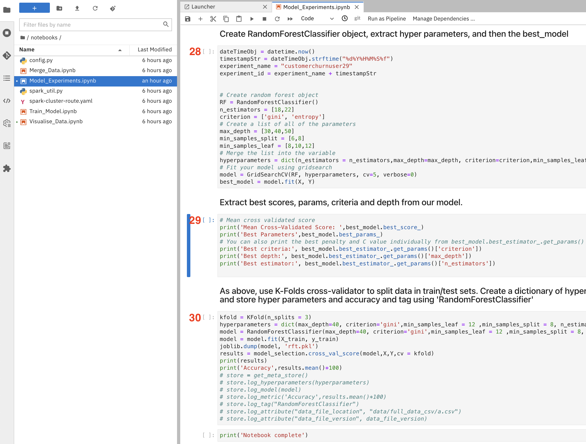 

28.   Create a RandomForest Classifier with these hyper parameters. Use GridSearch to output the best model / hyper parameters from the combinations supplied to its _fit_ method.
29.   Output the best values
30.   Use K-Folds cross-validator to split data into train/test sets. Create a dictionary of hyperparameter candidates, train the model using a RandomForestClassifier.

## Part 3: Visualise the Model Experiments. ##

Let’s use our model registry **Ml-Flow** to analyse compare the model performance. 

- Open the OpenShift console tab in your browser.
- Select the **Administrator Perspective**.
- Click **Networking > Routes**.
- Type **_mlflow_** in the Filter text box. OpenShift will display the link to the **_Ml Flow_** tool.

 

- Click the hyperlink in the **Location** column \
OpenShift will launch the **Ml-Flow** console in a new browser tab. 

- After logging in with your OpenShift credentials, you’ll be presented with a screen like this - showing all users’ experiments. 

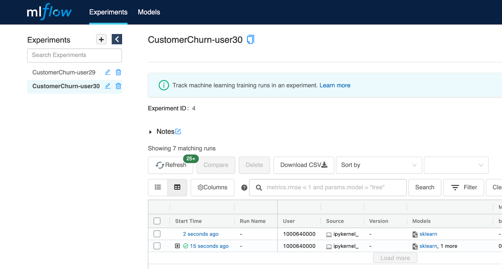 

- Filter on CustomerChurn-**userXX** , replacing **userXX** with your username in my case CustomerChurn-user30 - so you only see your own experiments. 

 

Click on the link under Start Time - to drill into one. You can see that out of the box, just by adding the simple **_mlflow_** based integration code you added earlier to your notebook, you get a fantastic amount of useful information. Including
- every experiment gets an id - which is useful for sharing and traceability purposes later
- your parameters are recorded as shown:

 

Scroll down and you see you get more - parameters, metrics, tags and artifacts associated with the experiment’s model output - binaries, yaml, json etc..

You also get the option to register the model - if you want to push it to production for example. Later on, you’ll do this.

 

Ml Flow is a very powerful capability for the following reasons. Every experiment that is ever run:

* can be easily pushed to this repo
* gets a unique ID - that can be traced throughout the workflow and its metadata, parameters etc, examined here at any time
* each experiment can be easily retrieved and repeated here by **_the same_** data scientist
* each experiment can be easily shared then retrieved and repeated here by **_other_** data scientists

## Part 4: Train the Model ##

Now following examination of our experiments In Ml Flow, let’s assume for performance reasons, as a data scientist, you’ve decided to proceed with the Decision Tree Classifier experiment and push that model to production.

- Go back to Jupyter Hub and ensure you’re in **ml-workshop-improved/notebook**
- Open the **_Train_Model.ipynb Jupyter_** notebook.

 

You have already encountered most of the cells here in the 2 previous notebooks. Therefore, we will just it describe at a high level here - then you can run the notebook yourself.

* Assume the data scientist did the two experiments you ran previously in the **_Model_Experiments.ipynb_** notebook. (in reality, they would probably run a lot more than two)
* After examining both experiments in Jupyter and Ml Flow, they decide they want to proceed with DecisionTreeClassifier - for whatever reason.
* So in this notebook, **_​​Train_Model.ipynb_** they use the DecisionTreeClassifier algorithm and all of the same parameters/hyper parameters they used previously, then train the model in the same way, and again push it to Ml Flow - this time with the model binaries (CustomerChurnPredictor.sav, CustomerChurnOrdinalEncoder.pkl, CustomerChurnOneHotEncoder.pkl) so they can be pushed to production later.

Now run the **_Train_Model.ipynb Jupyter_** notebook - cell by cell by continually hitting **SHIFT + ENTER**, on by choosing menu item** Kernel > Restart Kernel and Run all Cells**

## Part 5: Register the chosen Model ##

Go back to ML Flow - as described above in section **Part 3: Visualise the Model Experiments** 

Find your latest experiment as described above. This will be the one associated with the **_Train_Model.ipynb_** experiment.(it needs to be this one - as the 2 encoder binaries are pushed to the repo).

Verify this by navigating down to Artifacts as described above in  _Part 3: Visualise the Model Experiments._ Make sure the 2 encoders are there. If not, you probably selected the wrong experiment on the previous page. Make sure you have chosen the most recent.

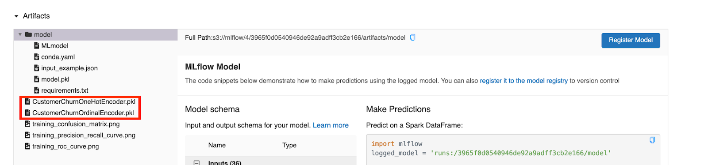 

Now we need to register a Model in ML Flow - to which we add our chosen experiment - for later deployment to production. 

Leave this tab open and open  ML Flow again - this time in a separate tab. Choose **Models** and **Create  Model**:

 

Name your model your **uXX** and click **Create**

 

Close this tab and go back to your other open Ml Flow tab. Click **Register Model**

 

Choose your newly registered model and click **Register**:

 

You can see a new model is created with version 1. Each time you register a new model under this model name, its version is incremented. 

We’re now ready to run an Airflow deployment pipeline to deploy this chosen model to a higher environment like Test or even Production.

Move back to Jupyter Hub, navigate to **ml-workshop/src/automation/deploy_model/ocp/** and open **deploy_model.pipeline**. ocp_deploy.py should already be there on the canvas as shown:

 

Right click on the **ocp_deploy.py** pipeline element and choose **Properties**.Ensure your selections look like the screenshot below. Pay particular attention to MODEL_NAME - you’ll need to change it to:

MODEL_NAME=**uXX**

i.e. the model name you created in the previous step, in my case **u29**

As this is the first version, you should not need to change your MODEL_VERSION yet, but change it running a subsequent time

This is how it should look:

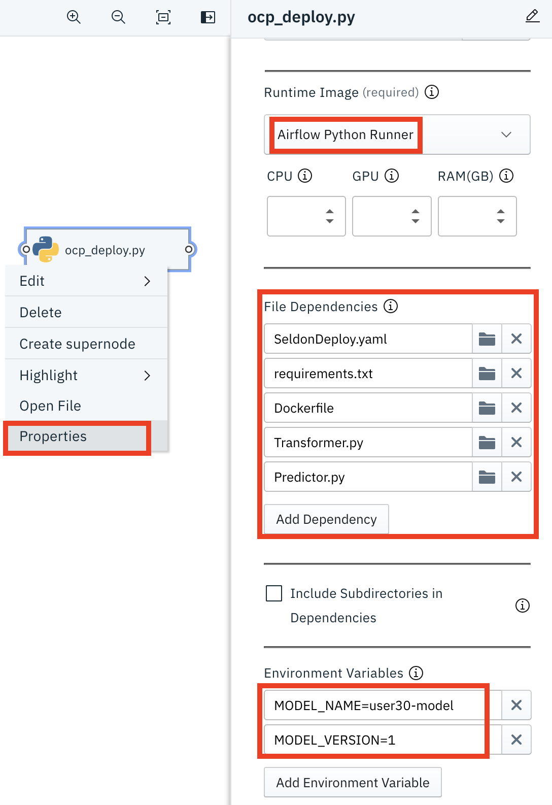 

Save your work by clicking on the **Save** button

 

## Part 5: Run Pipeline. ##

You can now run your pipeline. Click the Play button as shown. A useful naming convention is to enter a name in a format beginning with your username - followed by the month and day and the count of runs that day. This sends each run to the bottom of the list on the Airflow GUI.

Name it something like **userXX**-**MMDD**-01-deploy-model, in my case **_user30-0223-10-deploy-model_**. Also choose your Airflow Runtime and Runner as shown:

 

After 2 informational popups, your pipeline will kick off.

Now it’s time to view your pipeline in our workflow scheduler Airflow.

The same way you did previously with the Data Engineer pipeline, in a browser, open your **Airflow Route URL.** After logging in with your OpenShift credentials. Click DAGs and again filter on your username - and you’ll see something like this:

 

You should see your pipeline runs - including the deploy model one you just kicked off. Browse around as before - check logs, see how it can be used to schedule this job periodically etc.

When the colour has turned dark green - as it will if all goes well, you’re done! Otherwise, let an administrator know!

Now move to the next lab **_Lab 3 - ML OPs & Inference._**
