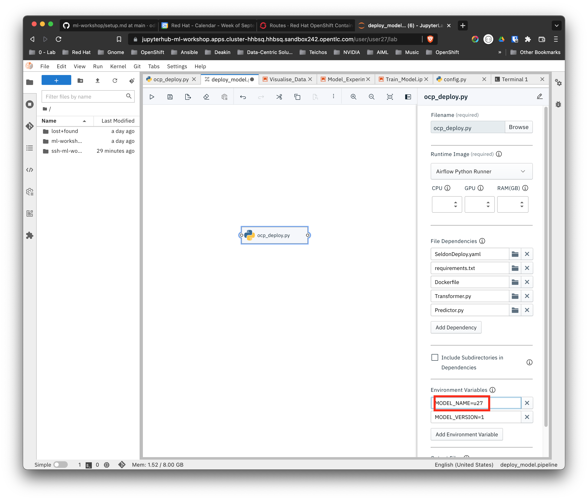
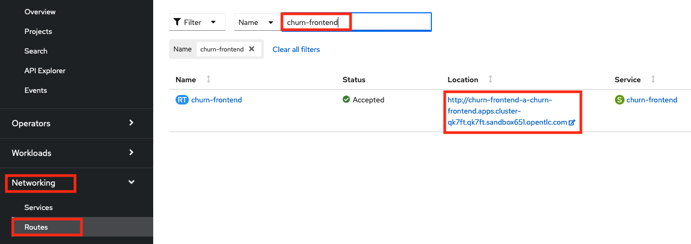
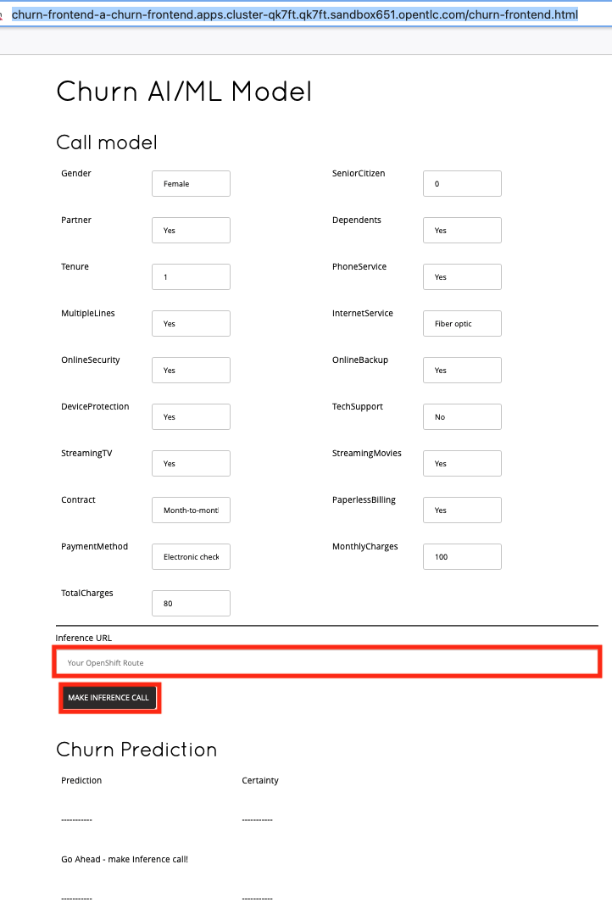
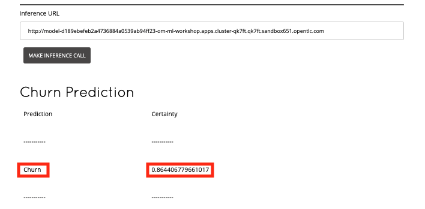

# Lab 3 - ML OPs & Inference

## Introduction

Now as a data scientist, we've selected our chosen experiment, trained
the model (a DecisionTreeClassifier) and finally, we've pushed it to our
ML Flow Registry.

You will recall, in the previous lab we gave this extra capability to
the Data Engineer to push their work to production - or to a higher
level environment. Effectively ML OPs functionality.

Many organisations will want to lock this down and only allow it to be
done by dedicated professionals - ML OPs engineers.

You can see in this diagram, the ML OPs capability is represented by the
3 stages spread horizontally in the middle of the highlighted area.
Regardless of who does it, the Data Scientist or the ML OPs Engineer,
these stages are executed:

-   Download Model

-   Build and Package Container

-   Deploy Model


During this phase, we also utilise the model serving component Seldon,
which wraps the model behind a RESTful API, making the model easily
available for inference. As the flow is fully automated, we also ease
and in fact eliminate the integration effort between application
development and data scientists teams.

As you already did this as a Data Scientist previously, when you ran the
**deploy_model** Airflow task, we're not going to do it again. Rather
we'll move straight to the Inference stage.

### Instructions for testing the Model via an API

You are now ready to test the API to your model.

1. Open the OpenShift tab on your browser.
2. Select the **Administrator Perspective** in the left panel.
3. Click **Networking > Routes**
4. Using the name you gave to your model in the previous lab.  Eg ```u27``` in this example:  
    
  Filter to find the model you deployed in the previous lab:
    

The URL under the Locations column is the URL our pipeline has created
for us - which we will use to make inference calls to our model. We will refer to that below as ***your inference URL***.  Make
note of your URL, in this example:  

```http://model-72b589fb2aa645b8ae02f4e286c57093-u27-ml-workshop.apps.cluster-hhbsq.hhbsq.sandbox242.opentlc.com/```


--------------------------------------------------------------------------------------------------------

## Testing an Inference Call to Your Model using a Webpage 
A little test application or a tool like _Postman_  is the simplest way to test the model.

1. In OpenShift, elect ther **Administrator Perspective**.
2. Click **Networking** > **Routes** 
3. Type *churn-frontend* in the **Filter** text box  

  

4. Copy the URL in the **Location** column tot he Clipboard
5. Open a new Browser tab and paste the URL. Then append ```/churn-frontend.html```.  
   E.g. ```https://churn-frontend-ml-workshop.apps.cluster-hhbsq.hhbsq.sandbox242.opentlc.com/churn-frontend.html```

   OpenShift launches the Churn Frontend application in the browser tab.  
   
  

**Note:** If you get a 404, or 503, change the protocol from HTTPS to HTTP.  

In the large textbox, enter ***your inference URL*** that you got a couple of steps back. Click __MAKE INFERENCE CALL__. Shortly, the page will show a prediction of __*Churn*__  or __*Not Churn*__  as a well as how certain the model is of this prediction. Feel free to experiment.
 


--------------------------------------------------------------------------------------------------------


## Inference Call using an API Testing Tool

If you are a developer and want to build the model call into your code, the other to make an inference call, you can use tools such as ```Postman``` or the command line using ```curl```. This way you can build the input JSON and output JSON into your code.

The following example uses *Postman* to illustrate. If you do not have Postman you can
access a free web version here: [https://web.postman.co/home](https://web.postman.co/home)

Open Postman, and create a new Workspace and add a new Collection and
then a new Request to it. Populate is as follows:

{width="7.057292213473316in"
height="2.413692038495188in"}

1.  Choose the POST method  
2.  Using the  ***your inference URL*** from the previous step, append the path ```/api/v1.0/predictions``` to the url.  
    E.g. ```http://model-3965f0d0540946de92a9adff3cb2e166-user30-model-ml-workshop.apps.cluster-4b94.4b94.sandbox923.opentlc.com/api/v1.0/predictions```  

3.  Click **Body** radio button  
4.  Click the **raw** radio button  
5.  Click the content-type drop-down list box (next to the **GraphQL** radio button) and click **JSON**  
6. Open a new bowser tab and open this link: [[The Github Gist]](https://gist.githubusercontent.com/tnscorcoran/e3e09eedb59f46b6d8f946e8faab153c/raw/934687194b1b2c420f6ad2ca1d2a8a5a4f1711c1/Telco%2520Churn%2520Inference%2520Body)  
7. Copy the JSON content from the Gist to the Clipboard.
8. Open the Postman browser tab and paste the JSON in the content section as illustrated above.
9. Click the **Send** button to make your inference call  
   The model that you deployed in the previous lab will then return a churn response.

  

Observe the response - comprising two fields:

1.  Predicted Certainty Score: The probability of a churn - here a very high 88%

2.  Predicted Class: A binary churn or not-churn based on the probability.

Congratulations - you've completed the third lab. Now move to the final
one: **AI/ML on OpenShift Workshop - Lab 4 - Optional Extra - Data
Analytics.**
