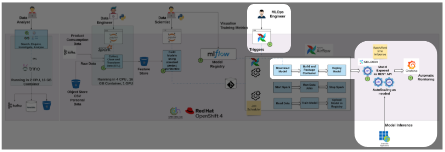
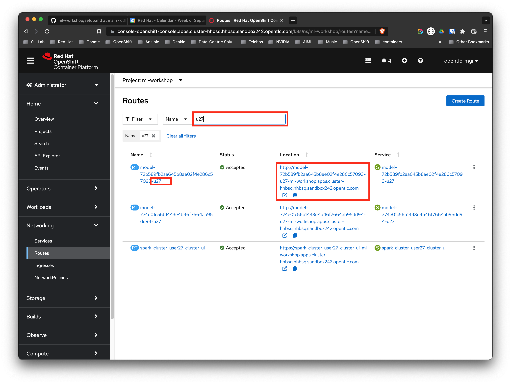
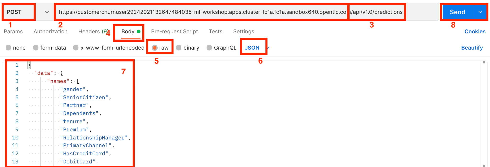

# Lab 3 - ML OPs & Inference

## Introduction

Now as a data scientist, we've selected our chosen experiment, trained
the model (a DecisionTreeClassifier) and finally, we've pushed it to our
ML Flow Registry.

You will recall, in the previous lab we gave this extra capability to
the Data Engineer to push their work to production - or to a higher
level environment. Effectively ML OPs functionality.

Many organisations will want to lock this down and only allow it to be
done by dedicated professionals - ML OPs engineers.

You can see in this diagram, the ML OPs capability is represented by the
3 stages spread horizontally in the middle of the highlighted area.
Regardless of who does it, the Data Scientist or the ML OPs Engineer,
these stages are executed:

-   Download Model

-   Build and Package Container

-   Deploy Model

During this phase, we also utilise the model serving component Seldon,
which wraps the model behind a RESTful API, making the model easily
available for inference. As the flow is fully automated, we also ease
and in fact eliminate the integration effort between application
development and data scientists teams.

As you already did this as a Data Scientist previously, when you ran the
**deploy_model** Airflow task, we're not going to do it again. Rather
we'll move straight to the Inference stage.

### Instructions for testing the Model via an API

You are now ready to test the API to your model.

1.  Open the OpenShift tab on your browser.

2.  Select the **Administrator** perspective in the left panel.

3.  Click **Networking \> Routes**

4.  Filter on your username and append *model*, i.e. **userXX-model** ,in my case **user30-model** as shown below.

{width="6.932292213473316in"
height="2.539433508311461in"}

The URL under the Locations column is the URL our pipeline has created
for us - which we will use to make inference calls to our model. Make
note of your URL, in my case

[[http://model-3965f0d0540946de92a9adff3cb2e166-user30-model-ml-workshop.apps.cluster-4b94.4b94.sandbox923.opentlc.com/]{.underline}](http://model-3965f0d0540946de92a9adff3cb2e166-user30-model-ml-workshop.apps.cluster-4b94.4b94.sandbox923.opentlc.com/)

In order to make an inference call, you can use tools such as Postman,
or the command line using curl, or there are various online options.
I'll use *Postman* to illustrate. If you do not have Postman you can
access a free web version here:
[[https://web.postman.co/home]{.underline}](https://web.postman.co/home)

Open Postman, and create a new Workspace and add a new Collection and
then a new Request to it. Populate is as follows:

{width="7.057292213473316in"
height="2.413692038495188in"}

1.  Choose the POST method

2.  Take your inference URL from the previous step

3.  append the path ***/api/v1.0/predictions*** to that\
    > to form the full URL, in my case\
    > [[http://model-3965f0d0540946de92a9adff3cb2e166-user30-model-ml-workshop.apps.cluster-4b94.4b94.sandbox923.opentlc.com/api/v1.0/predictions]{.underline}](http://model-3965f0d0540946de92a9adff3cb2e166-user30-model-ml-workshop.apps.cluster-4b94.4b94.sandbox923.opentlc.com/api/v1.0/predictions)

4.  Select Body

5.  Choose raw

6.  and JSON as shown as the content type.

7.  Paste the JSON located in [[This Github Gist]{.underline}](https://gist.githubusercontent.com/tnscorcoran/e3e09eedb59f46b6d8f946e8faab153c/raw/934687194b1b2c420f6ad2ca1d2a8a5a4f1711c1/Telco%2520Churn%2520Inference%2520Body)into the Body box. Notice this represents a customer, we're asking the model to predict how likely it is they will churn. Notice also, we're passing in string values such as Brokerage etc. Conversion using the *Ordinal* and *One-Hot* encoders to numeric values will be done by the running container exposing the API. This simplifies these API calls greatly for Application developers making these inference calls.

8.  Click Send to make your inference call

Here you see a sample response.

{width="6.0in"
height="3.6944444444444446in"}

Observe the response - comprising two fields:

1.  Predicted Certainty Score: The probability of a churn - here a very high 88%

2.  Predicted Class: A binary churn or not-churn based on the probability.

Congratulations - you've completed the third lab. Now move to the final
one: **AI/ML on OpenShift Workshop - Lab 4 - Optional Extra - Data
Analytics.**
