<!-- Copy and paste the converted output. -->

<!-----

You have some errors, warnings, or alerts. If you are using reckless mode, turn it off to see inline alerts.
* ERRORs: 0
* WARNINGs: 0
* ALERTS: 42

Conversion time: 16.999 seconds.

Using this Markdown file:

1. Paste this output into your source file.
2. See the notes and action items below regarding this conversion run.
3. Check the rendered output (headings, lists, code blocks, tables) for proper
   formatting and use a linkchecker before you publish this page.

Conversion notes:

* Docs to Markdown version 1.0β33
* Mon Apr 11 2022 15:47:32 GMT-0700 (PDT)
* Source doc: AI/ML on OpenShift Workshop - V2 - Lab 2 - Data Science
* This document has images: check for >>>>>  gd2md-html alert:  inline image link in generated source and store images to your server. NOTE: Images in exported zip file from Google Docs may not appear in  the same order as they do in your doc. Please check the images!

----->

>>>>>  gd2md-html alert:  ERRORs: 0; WARNINGs: 0; ALERTS: 42.

<ul style="color: red; font-weight: bold"><li>See top comment block for details on ERRORs and WARNINGs. <li>In the converted Markdown or HTML, search for inline alerts that start with >>>>>  gd2md-html alert:  for specific instances that need correction.</ul>

Links to alert messages:
<a href="#gdcalert1">alert1</a>
<a href="#gdcalert2">alert2</a>
<a href="#gdcalert3">alert3</a>
<a href="#gdcalert4">alert4</a>
<a href="#gdcalert5">alert5</a>
<a href="#gdcalert6">alert6</a>
<a href="#gdcalert7">alert7</a>
<a href="#gdcalert8">alert8</a>
<a href="#gdcalert9">alert9</a>
<a href="#gdcalert10">alert10</a>
<a href="#gdcalert11">alert11</a>
<a href="#gdcalert12">alert12</a>
<a href="#gdcalert13">alert13</a>
<a href="#gdcalert14">alert14</a>
<a href="#gdcalert15">alert15</a>
<a href="#gdcalert16">alert16</a>
<a href="#gdcalert17">alert17</a>
<a href="#gdcalert18">alert18</a>
<a href="#gdcalert19">alert19</a>
<a href="#gdcalert20">alert20</a>
<a href="#gdcalert21">alert21</a>
<a href="#gdcalert22">alert22</a>
<a href="#gdcalert23">alert23</a>
<a href="#gdcalert24">alert24</a>
<a href="#gdcalert25">alert25</a>
<a href="#gdcalert26">alert26</a>
<a href="#gdcalert27">alert27</a>
<a href="#gdcalert28">alert28</a>
<a href="#gdcalert29">alert29</a>
<a href="#gdcalert30">alert30</a>
<a href="#gdcalert31">alert31</a>
<a href="#gdcalert32">alert32</a>
<a href="#gdcalert33">alert33</a>
<a href="#gdcalert34">alert34</a>
<a href="#gdcalert35">alert35</a>
<a href="#gdcalert36">alert36</a>
<a href="#gdcalert37">alert37</a>
<a href="#gdcalert38">alert38</a>
<a href="#gdcalert39">alert39</a>
<a href="#gdcalert40">alert40</a>
<a href="#gdcalert41">alert41</a>
<a href="#gdcalert42">alert42</a>

>>>>> PLEASE check and correct alert issues and delete this message and the inline alerts.

# Lab 2 - Data Science #

**Introduction** 

Next, we feature three Jupyter notebooks the data scientist uses, pulling the prepared CSV data that the data engineer pushed to S3 object storage in the previous lab:

- They first visualise the data - to understand patterns in the data and whether there are any errors they need to fix before experimenting and training their models.
- They then experiment with different algorithms, parameters and hyperparameters. They push each experiment to the model repository, Verta. This repository contains all of the data and the actual model binaries should they wish to
    1. Compare different experiments
    2. Return to and retrieve any experiment they ran
    3. Share their experiments with others. In this way, we’re allowing silos between different actors in the workflow
- They then choose one of their experiments, which they wish to proceed with and push to production - in the next part of the workflow, the ML OPs phase

This diagram illustrates the section we’re implementing - the Data Science part of the overall AI/ML workflow:

**Instructions to access your prepared data file from the previous lab**

You need to access the prepared CSV data file you created and pushed to S3 object storage, in the previous lab under the Data Engineer persona.

Login to OpenShift using the credentials your administrator gave you. Ensure your workshop project ml-workshop is selected.

The first thing you need to do is retrieve the path and file pertaining to your username - which you as a data engineer created previously.  \
Choose the **Administration perspective**

- Navigate to **Networking > Routes**. 
- Filter on _minio_ - and open the _minio-ml-workshop-ui_ route as shown. 

- Enter the username and password minio / minio123 
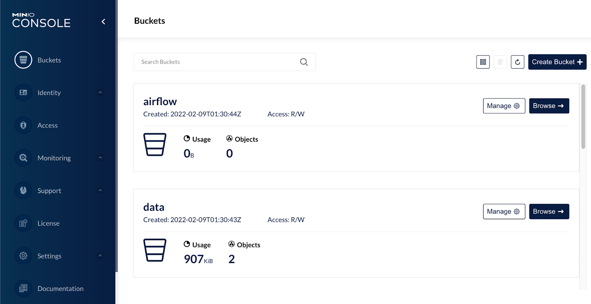

- Scroll down to the **data** bucket, and click the **Browse**. \
Minio displays a list of folders in the _data_ bucket. The folder-name format is: “_full_data_csv-&lt;your username>_” E.g. For user29 the folder is: _full_data_csv-user29_

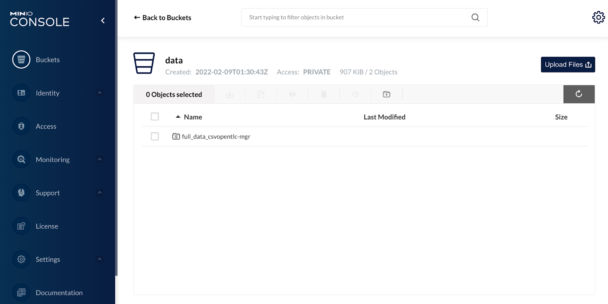

- Scroll through the list of folders and locate the folder with your username \
**Note**: There will be many folders there - be sure to identify the one containing **your username.**
- Click the folder that corresponds to your username. \
Minio displays the file(s) you created in the Data Engineering lab

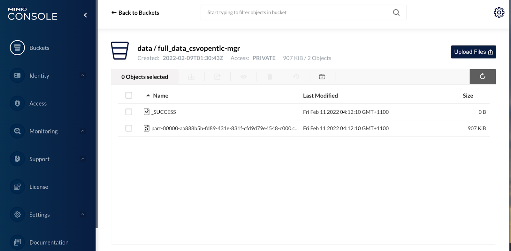

- Click the file with name starting with “part”:
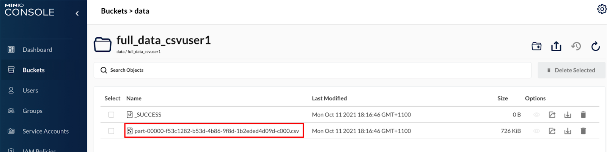

Minio displays a panel containing the details of the file you created in the Data Engineering lab. 

- Highlight the filename path as shown below and copy the text to the clipboard. E.g. <code>[part-00000-f53c1282-b53d-4b86-9f8d-](http://minio-ml-workshop-ui-ml-workshop.apps.cluster-lwwqr.lwwqr.sandbox779.opentlc.com/buckets/data/browse/ZnVsbF9kYXRhX2NzdnVzZXIxL3BhcnQtMDAwMDAtZjUzYzEyODItYjUzZC00Yjg2LTlmOGQtMWIyZWRlZDRkMDlkLWMwMDAuY3N2)1b2eded4d09d[-c000.csv](http://minio-ml-workshop-ui-ml-workshop.apps.cluster-lwwqr.lwwqr.sandbox779.opentlc.com/buckets/data/browse/ZnVsbF9kYXRhX2NzdnVzZXIxL3BhcnQtMDAwMDAtZjUzYzEyODItYjUzZC00Yjg2LTlmOGQtMWIyZWRlZDRkMDlkLWMwMDAuY3N2)</code>

- Copy this text to the Clipboard (E.g. Ctrl-C or Command-C) \
You need to copy this somewhere safe because we will refer to it throughout this section as **YOUR_CSV_FILE.**  \

- Open any editor you choose and paste this into a text editor so you can use it later. E.g. Sublime Text or Microsoft Word.

You file path should now look similar to this:

As mentioned we'll refer to this long filename string as **YOUR_CSV_FILE** - which later you’ll paste into the parameters.py source file

## Part 1: Visualise Data ##

Now to our Data Science focused Jupyter notebooks. As we did with Minio, we will find the url for Jupyterhub within the routes of the OpenShift console.

1. Open the browser tab with the OpenShift console.
2. Open the **Administrator perspective**.
3. Click **Networking > Routes**. 
4. Type **Jupyterhub** in the **Filter** text box.

OpenShift reduces the list of routes as you type the filter.

5. Click the Jupyterhub link in the **Location** column of the **Routes** display. 
   
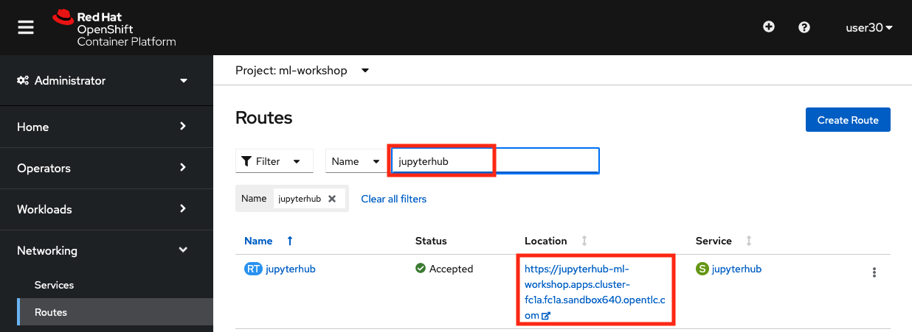

Because you shutdown your Jupyter server at the end of the last workshop, you’ll again be presented with the Jupyter screen where you choose the base image to work with. As we’re now assuming the role of a data scientist, do the following:

JupyterHub displays the Start Notebook Server page.

1. Click **SciKit v1.10 - Elyra Notebook Image**
2. Select **Large**
3. Click **Start Server**.

**Warning:** Please select the correct notebook image, otherwise the lab will not work.

Jupyterhub starts the notebook server for the Data Scientist.

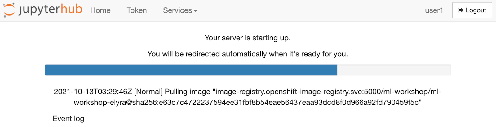

After a few minutes the notebook will have started and the Jupyter notebook will be displayed.

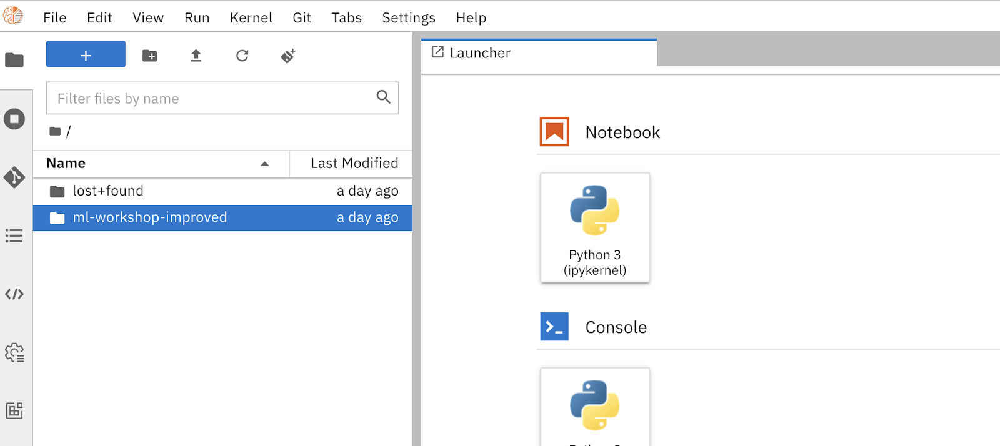

Observe:
* The same _ml-workshop-improved_ folder we previously pulled down from our GitHub repository \
git clone [https://github.com/bryonbaker/ml-workshop-improved](https://github.com/bryonbaker/ml-workshop-improved) 

**Before we get going, you need to make some small changes to the code.**

* Navigate to ​​**ml-workshop-improved/notebook** and open **parameters.py**
* Locate line of code with **minioFilename** and paste the file name you saved earlier (**YOUR_CSV_FILE**) in this lab into the code as illustrated below. Note, your file name will be unique to you

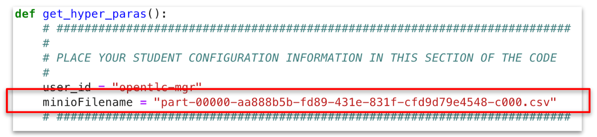

- Click **File + Save** to save the file.

Now to run your first notebook, double click the file **Visulaise_Data.ipynb** as shown

# TODO screenshot has wrong filename #

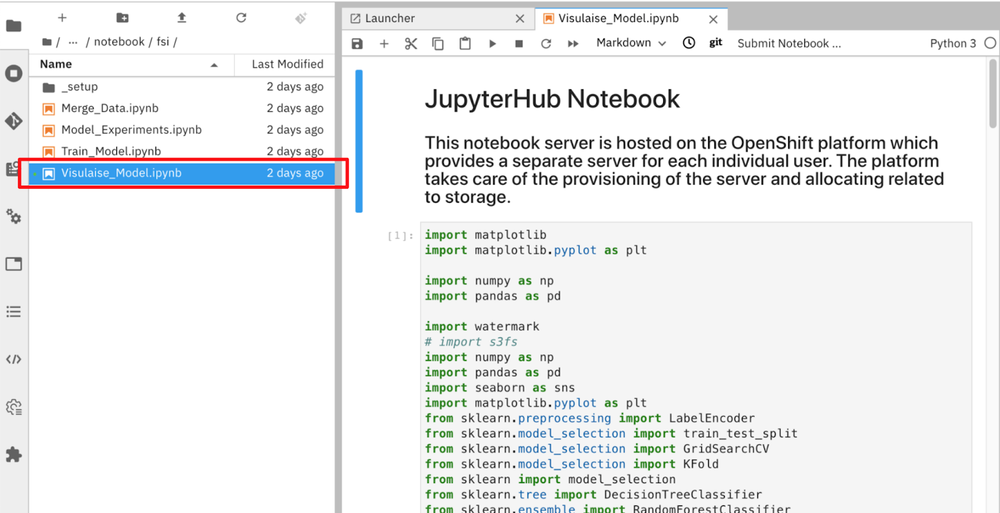

1.  Scroll up to the top of the notebook
2.  Click in cell **[1]**.

You will now step through the notebook one cell at a time.

12. Type **[Shift] + [Return]** to step through each cell in the notebook.

Now, as previously, select the first cell and walk through each cell executing you go by clicking SHIFT + RETURN.

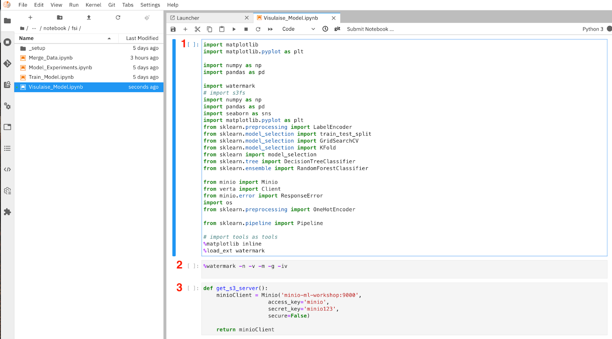

1. Import our desired Python libraries. (notice we don’t need to do any **_pip install_**s - our administrator has bundled all of our required libraries into this base container image - which we selected earlier the _MLWorkShop Notebook Image_)
2. _watermark_ outputs the versions of various components, libraries, operating system attributes etc.
3. Here we connect to our S3 object store, Minio, using the URL and credentials shown

4. In this cell we also output the first 5 lines of the file - so the data scientist can get a quick view of the data.
5. We output the dimensions of the data in rows and columns (features)
6. Here we output various data around the columns (features) including their types, names etc
7. Using _describe(), _we output various statistical data associated with the entire dataset, max, mean etc. values for numeric columns.

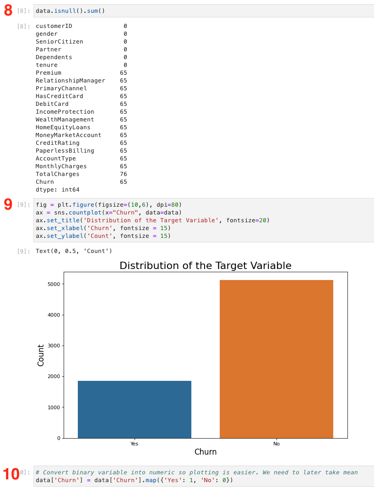

8. We output the sum of rows with null values with nulls - to assess data for errors, e.g null for _charges_ indicates an error.
9. Here we output the total count of the **_labeled _**column, Churn. We need a decent spread, and we have it - with just over 2 to 1.
10. Here we make a simple conversion from Yes and  No to 1 and 0, to facilitate plotting.

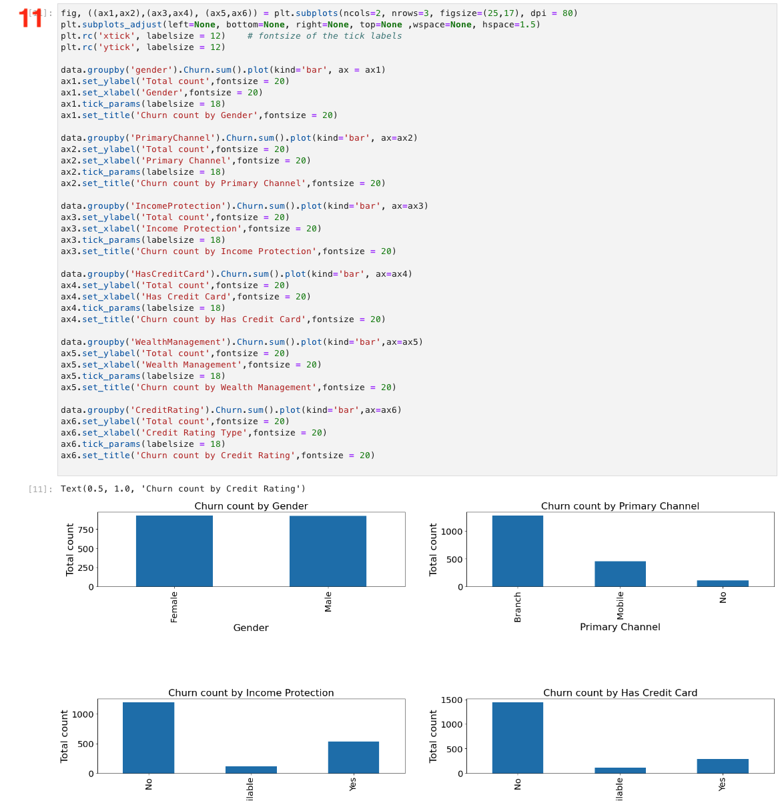

11.  This cell visually outputs churn count by various features in the data set
    

12. Replace spaces with numpy NAN values
13. Output sum of NAN and None values
14. Convert to numeric
15. Fill NANs with the mean
16. Here we output a box plot - a useful visualization of 2 dimensions by the labeled column _Churn_

## Part 2: Experiment with Models ## 

At this point, as a data scientist, we have a good understanding of the data. Now it's time to start experimenting with different models, parameters and hyper parameters.

As we experiment, we want our notebook to create an experiment id for every experiment (which is guaranteed to be unique within our team, as it uses user id and timestamp as a basis). 

This experiment id is then used as an identifier when we push our experiment metadata and binaries to our model repository, Verta. In this way, we retrieve and repeat any experiment we have done, as well as share this experiment with other team members, breaking down silos between teams and individuals in AI//ML workflows.

1. Using the File Explorer, open the **Model_Experiments.ipynb** notebook. 
Jupyterhub opens the code windows.

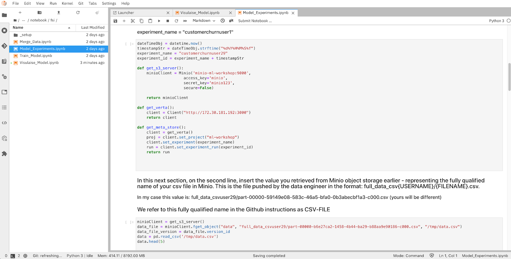

Next, just as you did in the previous lab you will step through the code one cell at a time. **Note there are 3 changes you’ll need to make to your cells - which we’ll highlight below.**

1. Scroll up to the top of the notebook
2. Click in cell **[1]**.

You will now step through the notebook one cell at a time.

4. Type **[Shift] + [Return]** to step through each cell in the notebook.

1. Do imports - more applicable when we want to use _Ray_.
2. More imports of libraries we need
3. See _watermark _description of this cell above in - **_first Data Science workshop - Visualisation_**

>>>>>  gd2md-html alert: inline image link here (to images/image23.png). Store image on your image server and adjust path/filename/extension if necessary.  (<a href="#">Back to top</a>)(<a href="#gdcalert24">Next alert</a>) >>>>> 

1. Here we pull in the user-specific parameters you added earlier to **hyper_parameters.py **for use in the file.
2. Here we add some simple integration code - to allow the data scientist 
    1. Retrieve the CSV file prepared earlier data engineer, from Minio S3 object storage
    2. Participate their work in the workflow. \
The HOST line on top and 4 lines using ml-flow is all they need to  push all of their experiments to our model registry** Ml Flow**
3. Here we retrieve the CSV we prepared in the Data Engineer lab earlier and output the first 5 lines of the file - so the data scientist can get a quick view of the data.

Run all the way down to cell 17, _Feature Engineering Pipeline_, as all cells until then are discussed above  in - **_first Data Science workshop - Visualisation_**

>>>>>  gd2md-html alert: inline image link here (to images/image24.png). Store image on your image server and adjust path/filename/extension if necessary.  (<a href="#">Back to top</a>)(<a href="#gdcalert25">Next alert</a>) >>>>> 

1. Here we use an Ordinal Encoder to convert simple binary values to a numeric representation. Output the data after applying the Ordinal Encoder.
2. Here we use a One Hot Encoder to convert multi valued features to a numeric representation. Output the data after applying the One Hot Encoder.
3. Here we split our data set into a training and a testing set, and discard unwanted columns customer id and our labeled column Churn.  
4. Further data set refinement.

 \
 \

>>>>>  gd2md-html alert: inline image link here (to images/image25.png). Store image on your image server and adjust path/filename/extension if necessary.  (<a href="#">Back to top</a>)(<a href="#gdcalert26">Next alert</a>) >>>>> 

 \

1. Create a DecisionTreeClassifier with these hyper parameters
2. User GridSearch to output the best model / hyper parameters from the combinations supplied to its _fit_ method.
3. Print out those best model parameters
4. Use K-Folds cross-validator to split data into train/test sets. Create a dictionary of hyperparameter candidates, train the model using a DecisionTreeClassifier. Print and store hyperparameters and accuracy in Verta and tag using 'DecisionTreeClassifier''. The **_store_** method lushes this metadata to Verta, which you’ll see below.

>>>>>  gd2md-html alert: inline image link here (to images/image26.png). Store image on your image server and adjust path/filename/extension if necessary.  (<a href="#">Back to top</a>)(<a href="#gdcalert27">Next alert</a>) >>>>> 

1. Modify the 3rd line substituting your username in place of user29.  \
Then we create a Random Forest Classifier with these hyper parameters. 
2. This cell and cell 27 are equivalents of the previous Decision Tree classifier cells.

**Part 3: Visualise the Model Experiments.**

Let’s use our model registry **Ml-Flow** to analyse compare the model performance. 

1. Open the OpenShift console tab in your browser.
2. Select the **Administrator Perspective**.
3. Click **Networking > Routes**.
4. Type **_mlflow_** in the Filter text box. \
OpenShift will display the link to the **_Ml Flow_** tool.

>>>>>  gd2md-html alert: inline image link here (to images/image27.png). Store image on your image server and adjust path/filename/extension if necessary.  (<a href="#">Back to top</a>)(<a href="#gdcalert28">Next alert</a>) >>>>> 

5. Click the hyperlink in the **Location** column \
OpenShift will launch the **Ml-Flow** console in a new browser tab. \
 \
 \
 \
 \
 \
 \
 \
 \
 \
 \
 \
 \

6. After logging in with your OpenShift credentials, you’ll be presented with a screen like this - showing all users’ experiments. \

>>>>>  gd2md-html alert: inline image link here (to images/image28.png). Store image on your image server and adjust path/filename/extension if necessary.  (<a href="#">Back to top</a>)(<a href="#gdcalert29">Next alert</a>) >>>>> 

 \

7. Filter on CustomerChurn-**userXX** , replacing **userXX ** with your username in my case CustomerChurn-user30 - so you only see your own experiments. 

    

>>>>>  gd2md-html alert: inline image link here (to images/image29.png). Store image on your image server and adjust path/filename/extension if necessary.  (<a href="#">Back to top</a>)(<a href="#gdcalert30">Next alert</a>) >>>>> 

8. Click on the link under Start Time - to drill into one. You can see that out of the box, just by adding the simple **_mlflow_** based integration code you added earlier to your notebook, out of the box, you get a fantastic amount of useful information. Including
    1. every experiment gets an id - which s useful for sharing and traceability purposes later
    2. your parameters are recorded as shown:

>>>>>  gd2md-html alert: inline image link here (to images/image30.png). Store image on your image server and adjust path/filename/extension if necessary.  (<a href="#">Back to top</a>)(<a href="#gdcalert31">Next alert</a>) >>>>> 

Scroll down and you see you get more - parameters, metrics, tags and artifacts associated with the experiment’s model output - binaries, yaml, json etc..

You also get the option to register the model - if you want to push it to production for example. Later on, you’ll do this.

>>>>>  gd2md-html alert: inline image link here (to images/image31.png). Store image on your image server and adjust path/filename/extension if necessary.  (<a href="#">Back to top</a>)(<a href="#gdcalert32">Next alert</a>) >>>>> 

Ml Flow is a very powerful capability for the following reasons. Every experiment that is ever run:

* can be easily pushed to this repo
* gets a unique ID - that can be traced throughout the workflow and its metadata, parameters etc, examined here at any time
* each experiment can be easily retrieved and repeated here by **_the same_** data scientist
* each experiment can be easily shared then retrieved and repeated here by **_other_** data scientists

**Part 4: Train the Model**

Now following examination of our experiments In Ml Flow, let’s assume for performance reasons, as a data scientist, you’ve decided to proceed with the Decision Tree Classifier experiment and push that model to production.

1. Go back to Jupyter Hub and ensure you’re in **ml-workshop-improved/notebook**
2. Open the **_Train_Model.ipynb Jupyter _**notebook.

>>>>>  gd2md-html alert: inline image link here (to images/image32.png). Store image on your image server and adjust path/filename/extension if necessary.  (<a href="#">Back to top</a>)(<a href="#gdcalert33">Next alert</a>) >>>>> 

You have already encountered most of the cells here in the 2 previous notebooks. Therefore, we will just it describe at a high level here - then you can run the notebook yourself.

* Assume the data scientist did the two experiments you ran previously in the **_Model_Experiments.ipynb_** notebook. (in reality, they would probably run a lot more than two)
* After examining both experiments in Jupyter and Ml Flow, they decide they want to proceed with DecisionTreeClassifier - for whatever reason.
* So in this notebook, **_​​Train_Model.ipynb_** they use the DecisionTreeClassifier algorithm and all of the same parameters/hyper parameters they used previously, then train the model in the same way, and again push it to Ml Flow - this time with the model binaries (CustomerChurnPredictor.sav, CustomerChurnOrdinalEncoder.pkl, CustomerChurnOneHotEncoder.pkl) so they can be pushed to production later.

Now run the **_Train_Model.ipynb Jupyter _**notebook - cell by cell by continually hitting **SHIFT + ENTER**, on by choosing menu item** Kernel > Restart Kernel and Run all Cells**

**Part 6: Register the chosen Model**

Go back to ML Flow - as described above in section **Part 3: Visualise the Model Experiments** 

Find your latest experiment as described above. This will be the one associated with the **_Train_Model.ipynb _**experiment.(it needs to be this one - as the 2 encoder binaries are pushed to the repo).

Verify this by navigating down to Artifacts as described above in  **Part 3: Visualise the Model Experiments.** Make sure the 2 encoders are there. If not, you probably selected the wrong experiment on the previous page. Make sure you have chosen the most recent.

>>>>>  gd2md-html alert: inline image link here (to images/image33.png). Store image on your image server and adjust path/filename/extension if necessary.  (<a href="#">Back to top</a>)(<a href="#gdcalert34">Next alert</a>) >>>>> 

Now we need to register a Model in ML Flow - to which we add our chosen experiment - for later deployment to production. 

Leave this tab open and open  ML Flow again - this time in a separate tab. Choose **Models** and **Create  Model**:

>>>>>  gd2md-html alert: inline image link here (to images/image34.png). Store image on your image server and adjust path/filename/extension if necessary.  (<a href="#">Back to top</a>)(<a href="#gdcalert35">Next alert</a>) >>>>> 

Name your model your _username-model**, **_i.e.**  uXX** and click **Create**

>>>>>  gd2md-html alert: inline image link here (to images/image35.png). Store image on your image server and adjust path/filename/extension if necessary.  (<a href="#">Back to top</a>)(<a href="#gdcalert36">Next alert</a>) >>>>> 

Close this tab and go back to your other open Ml Flow tab. Click **Register Model**

>>>>>  gd2md-html alert: inline image link here (to images/image36.png). Store image on your image server and adjust path/filename/extension if necessary.  (<a href="#">Back to top</a>)(<a href="#gdcalert37">Next alert</a>) >>>>> 

Choose your newly registered model and click **Register**:

>>>>>  gd2md-html alert: inline image link here (to images/image37.png). Store image on your image server and adjust path/filename/extension if necessary.  (<a href="#">Back to top</a>)(<a href="#gdcalert38">Next alert</a>) >>>>> 

You can see a new model is created with version 1. Each time you register a new model under this model name, its version is incremented. 

We’re now ready to run an Airflow deployment pipeline to deploy this chosen model to a higher environment like Test or even Production.

Move back to Jupyter Hub, navigate to **ml-workshop-improved/airflow/deploy_model/ocp/** and open **deploy_model.pipeline**. ocp_deploy.py should already be there on the canvas as shown:

>>>>>  gd2md-html alert: inline image link here (to images/image38.png). Store image on your image server and adjust path/filename/extension if necessary.  (<a href="#">Back to top</a>)(<a href="#gdcalert39">Next alert</a>) >>>>> 

Right click on the **ocp_deploy.py** pipeline element and choose **Properties**.Ensure your selections look like the screenshot below. Pay particular attention to MODEL_NAME - you’ll need to change it to:

MODEL_NAME=**userXX-model**

i.e. the model name you created in the previous step, in my case **.**

As this is the first version, you should not need to change your MODEL_VERSION yet, but change it running a subsequent time

This is how it should look:

 

>>>>>  gd2md-html alert: inline image link here (to images/image39.png). Store image on your image server and adjust path/filename/extension if necessary.  (<a href="#">Back to top</a>)(<a href="#gdcalert40">Next alert</a>) >>>>> 

Save your work by clicking on the **Save** button

>>>>>  gd2md-html alert: inline image link here (to images/image40.png). Store image on your image server and adjust path/filename/extension if necessary.  (<a href="#">Back to top</a>)(<a href="#gdcalert41">Next alert</a>) >>>>> 

**Run Pipeline**

You can now run your pipeline. Click the Play button as shown. A useful naming convention is to enter a name in a format beginning with your username - followed by the month and day and the count of runs that day. This sends each run to the bottom of the list on the Airflow GUI.

something like **userXX**-**MMDD**-01-deploy-model, in my case **_user30-0223-10-deploy-model_**. Also choose your Airflow Runtime and Runner as shown:

>>>>>  gd2md-html alert: inline image link here (to images/image41.png). Store image on your image server and adjust path/filename/extension if necessary.  (<a href="#">Back to top</a>)(<a href="#gdcalert42">Next alert</a>) >>>>> 

After 2 informational popups, your pipeline will kick off.

Now it’s time to view your pipeline in our workflow scheduler Airflow.

The same way you did previously with the Data Engineer pipeline, in a browser, open your **Airflow Route URL.** After logging in with your OpenShift credentials. click DAGs and again filter on your username - and you’ll see something like this:

>>>>>  gd2md-html alert: inline image link here (to images/image42.png). Store image on your image server and adjust path/filename/extension if necessary.  (<a href="#">Back to top</a>)(<a href="#gdcalert43">Next alert</a>) >>>>> 

You should see your pipeline runs - including the deploy model one you just kicked off. Browse around as before - check logs, see how it can be used to schedule this job periodically etc.

When the colour has turned dark green - as it will if all goes well, you’re done! Otherwise, let an administrator know!

Now move to the next lab **_AI/ML on OpenShift Workshop - V2 - Lab 3 - ML OPs & Inference._**
