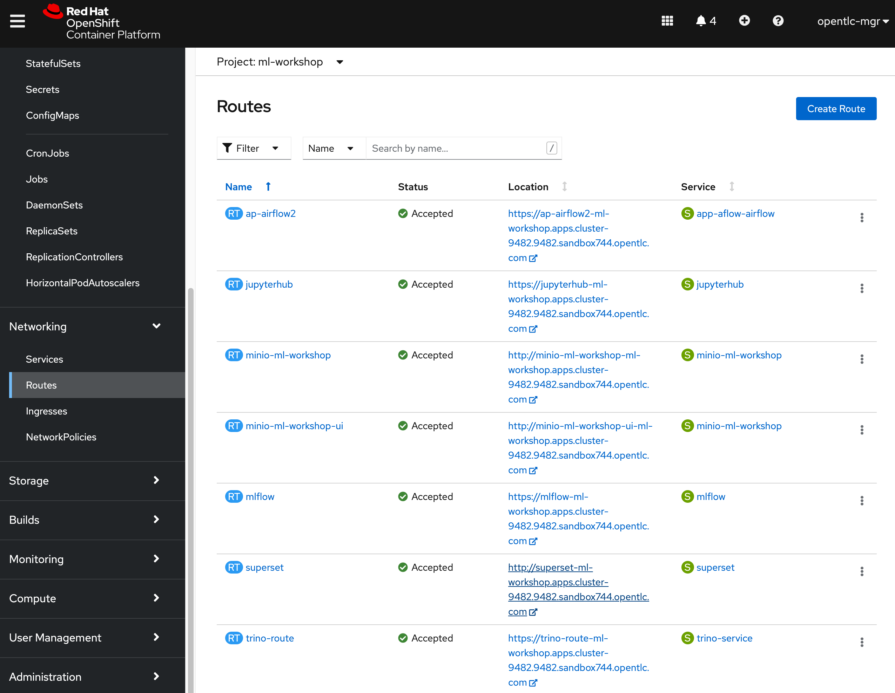
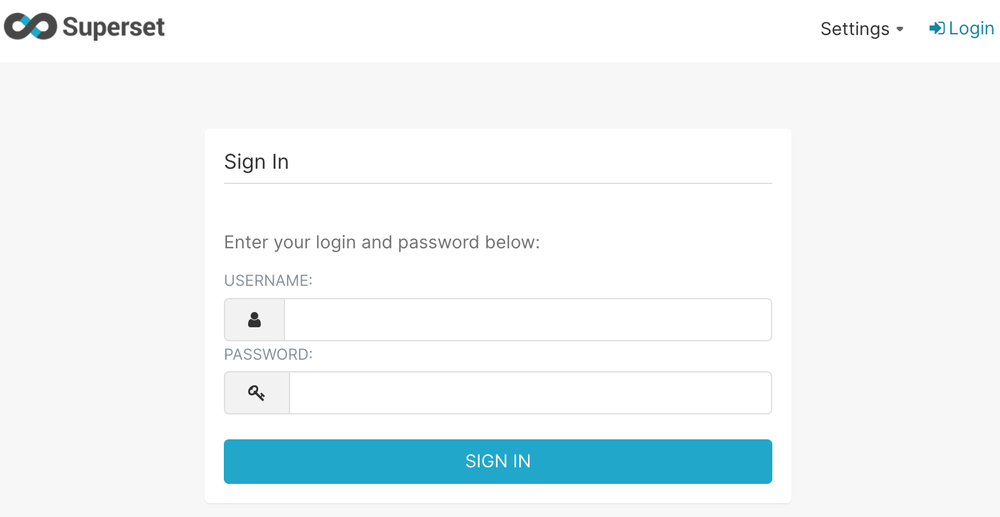
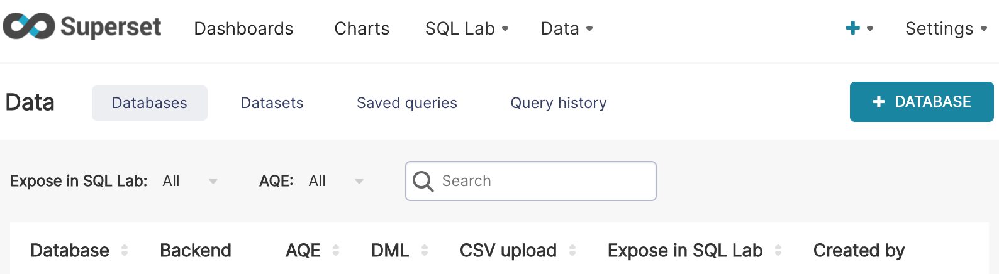
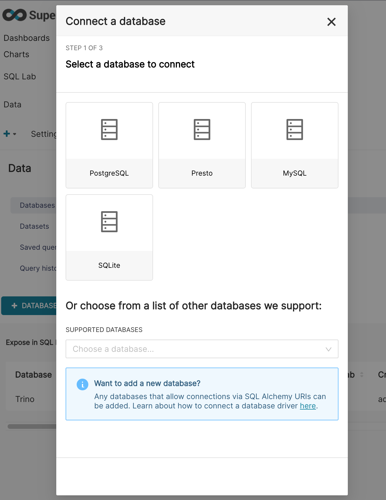
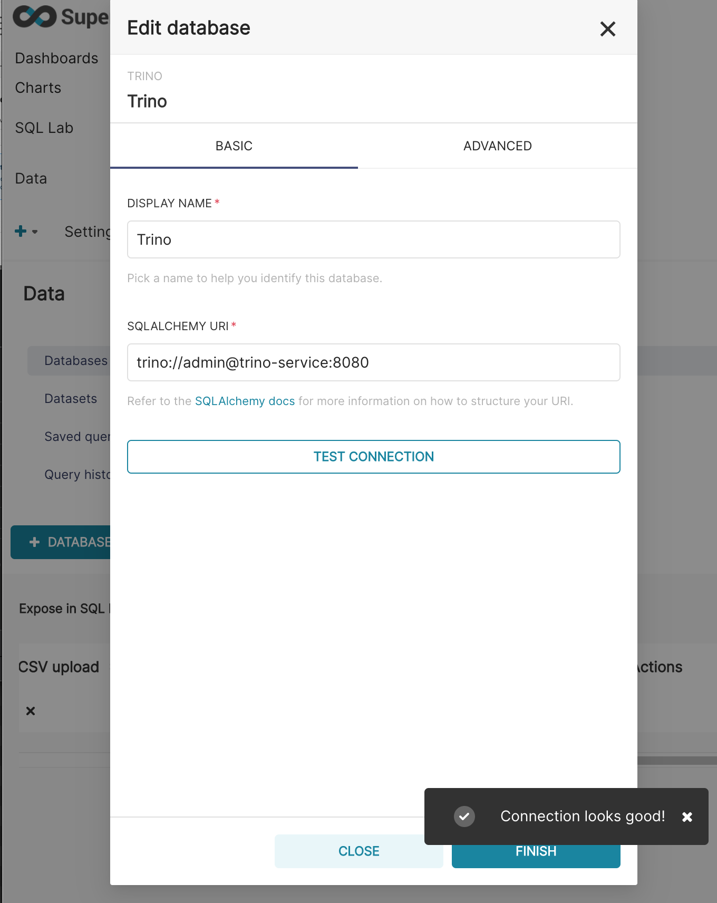
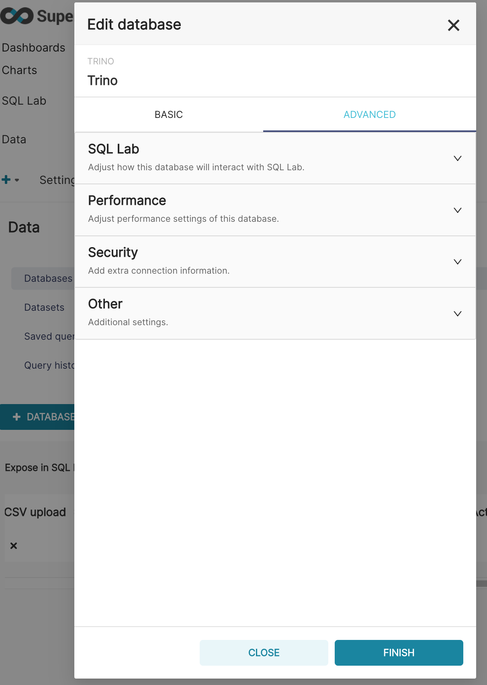
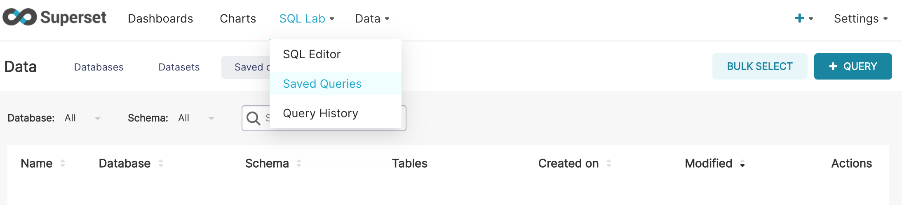
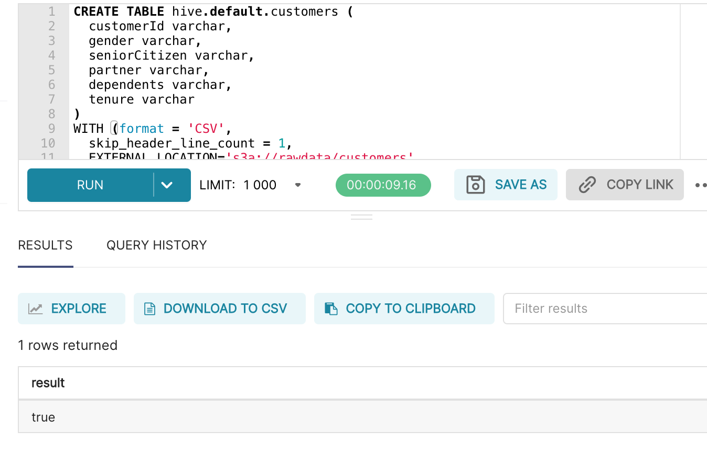
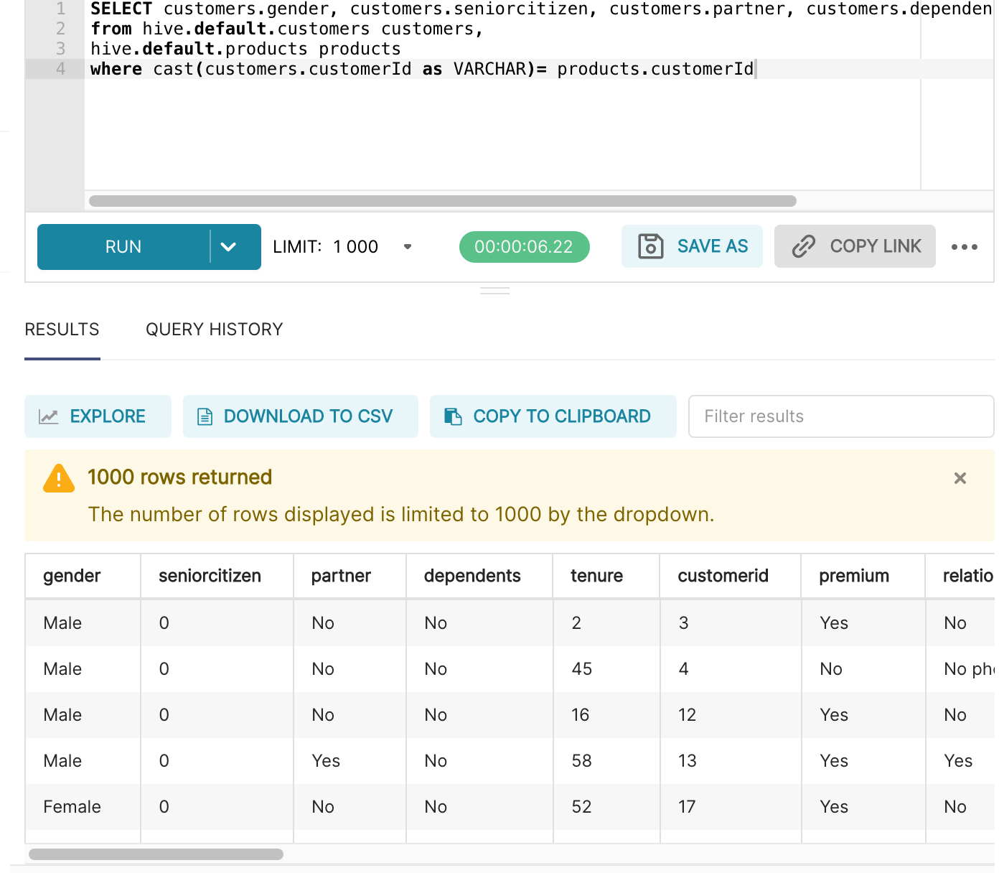
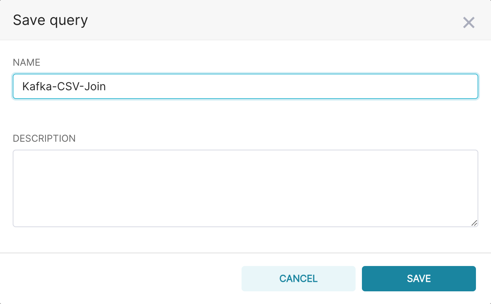

# Open Data Hub Workshop Setup Instructions

## Prerequisites
You'll need:
- An OpenShift 4.8 cluster - with admin rights. You can create one by following the instructions [here](http:/try.openshift.com), or via RHPDS (Red Hat staff only).
- the OpenShift command line interface, _oc_ available [here](https://docs.openshift.com/container-platform/4.6/cli_reference/openshift_cli/getting-started-cli.html)
- Ansible CLI (preferred version 2.13.x)


## Ansible Playbook

The Ansible playbook ml-workshop-ansible.yaml Installs performs the following:

- Install Open Data Hub Operator
- Create Open Data Hub Subscription
- Download and apply KfDef to deploy workshop applications (Jupyter, Minio, Kafka, Airflow, Mlflow)
- Uploads data file to S3 bucket

It does not configure Superset and Trino. Please follow the instructions below to set up Superset and Trino for the Data Analytics workshop.

Run the playbook from the command line:
~~~
ansible-playbook src/deploy/ansible/ml-workshop-ansible.yaml 
~~~
--------------------------------------------------------------------------------------------------------

## Configure Superset

Now you need to set up Superset to talk to our S3 and Kafka raw data via Trino - exposing the data via SQL.

1. Open the OpenShift console in your browser tab.  
     

2. Click the url for *superset*  
   OpenShift opens a new browser tab and displays the Superset login page.   
     

5. Enter the following credentials:   
* Username: **admin**   
* Password: **admin**   
6. Click **SIGN IN**  
   Superset diaplays the main console.  
     

7. Click: **Data > Databases**  
   Superset displays a list of configured databases.  
     

8. Click: the **"+ DATABASE"** button  
   Superset prompts for the database connection details
     

9. Click the **Supported Databases** drop-down list
10. Scroll down to the entry **Trino** and click it.
11. Copy and paste the following text into the **SQL Alchemy URI** text box:
```
trino://admin@trino-service:8080
```
12. Click **Test Connection**.  
If all steps have been performed correctly, Superset displays the message **Connection looks good!**.
     

13. Click the **Advanced** tab in the **Edit Database** form.  
Superset prompts for the advanced database configuration.   
     

14. Click **SQL Lab**.
15. Complete the form as illustrated in the following figure:  
     
16. Click **CONNECT** (or **FINISH** if you have done this step previously)\
    Superset saves the connection details and displays the main console
17. Click **SQL Lab > Saved Queries** in the main toolbar.   
     

18. Click the **+ QUERY** button.

<span style="color:yellow">*NOTE: **DO NOT SAVE THE QUERY**. We don't save this as it only needs to be run once per workshop*</span>

19. Copy and paste the query editor:   
      ```
      CREATE TABLE hive.default.customers (
      customerId varchar,
      gender varchar,
      seniorCitizen varchar,
      partner varchar,
      dependents varchar,
      tenure varchar
      )
      WITH (format = 'CSV',
      skip_header_line_count = 1,
      EXTERNAL_LOCATION='s3a://rawdata/customers'
      )
      ```

20. Click **Run**.  
   Superset displays *Result - true* as shown.  
     

21. Replace the SQL command with:  
      ```
      SELECT customers.gender, customers.seniorcitizen, customers.partner, customers.dependents, customers.tenure, products.*  
      from hive.default.customers customers,
      customerchurn.default.data products
      where cast(customers.customerId as VARCHAR) = cast(products.customerId as VARCHAR)
      ```   
   Run the query as shown. You should see a resultset spanning personal and product consumption customer data.  
     

22. Click the  button .   
Superset displays the Save As dialog box.

23. Click the **Name** text box. Replace the text with: **Kafka-CSV-Join**



22. Click the **SAVE** button .

# Setup Complete

You are now done with setup!
