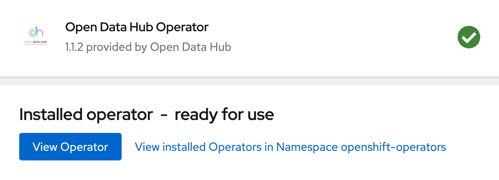
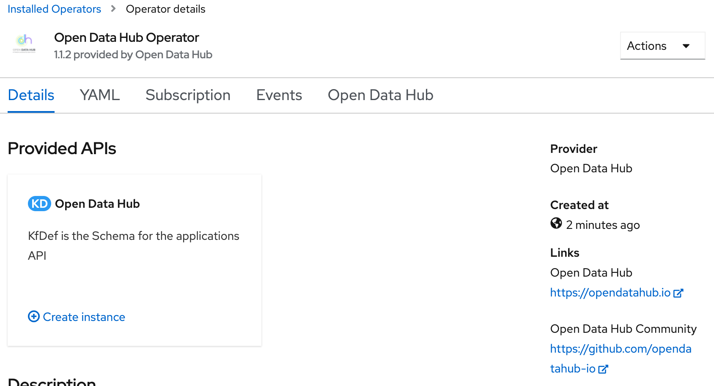
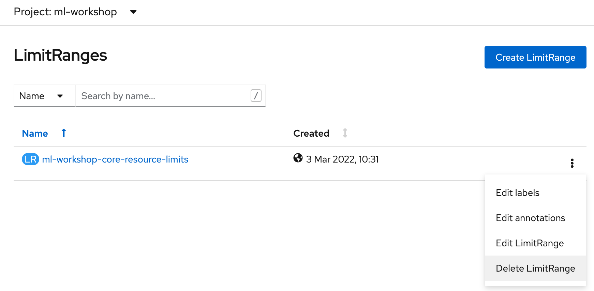
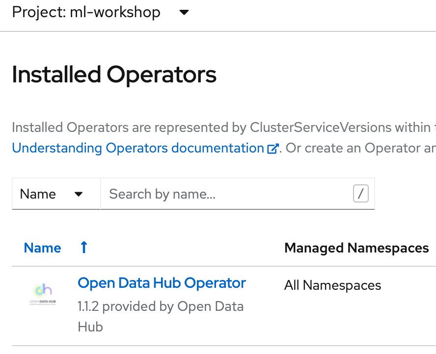
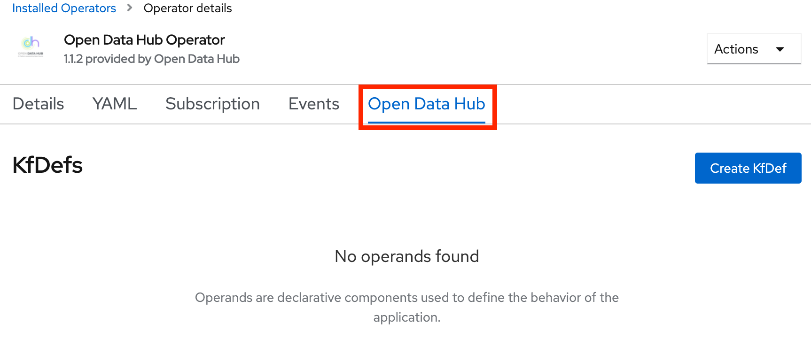
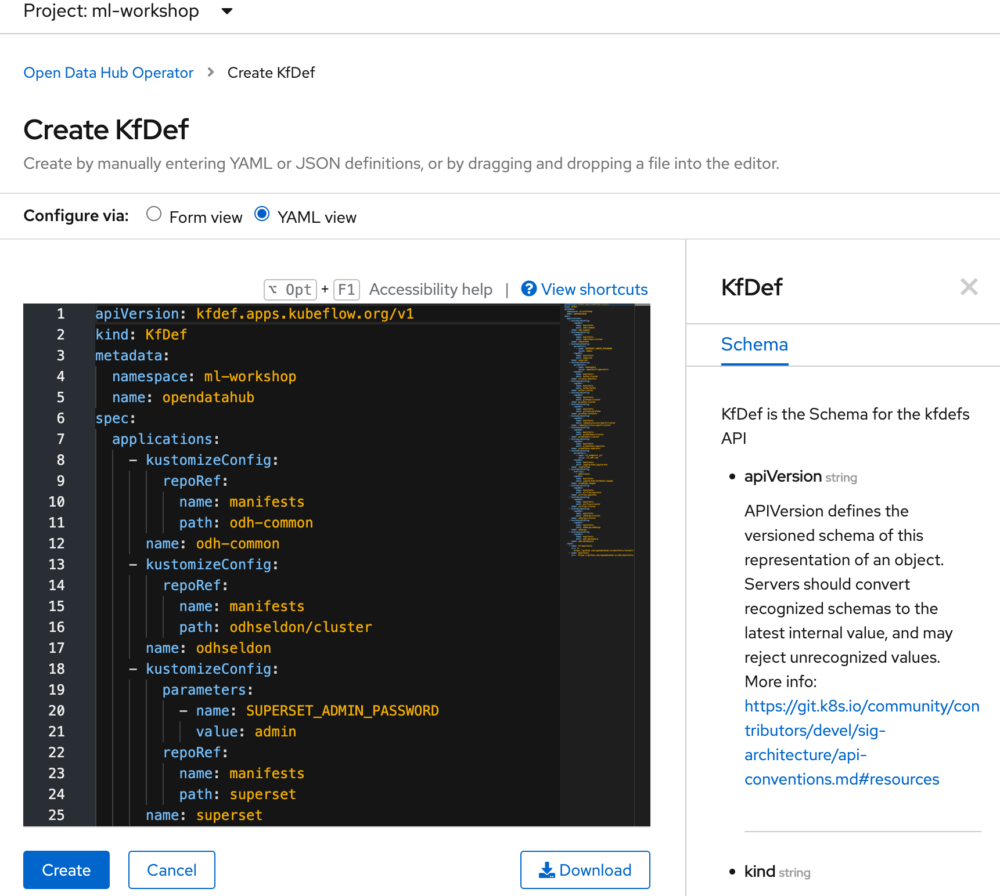
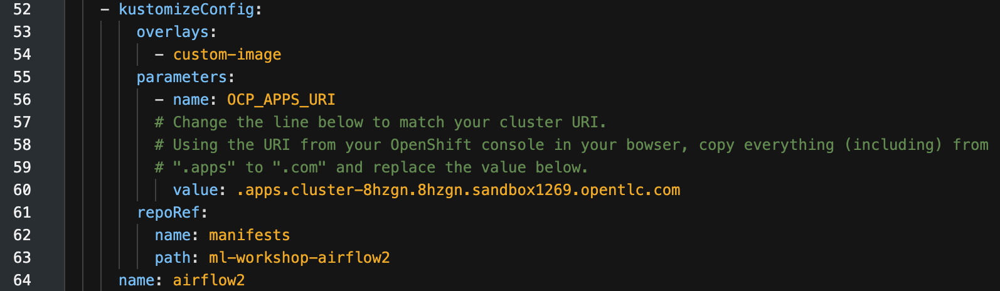
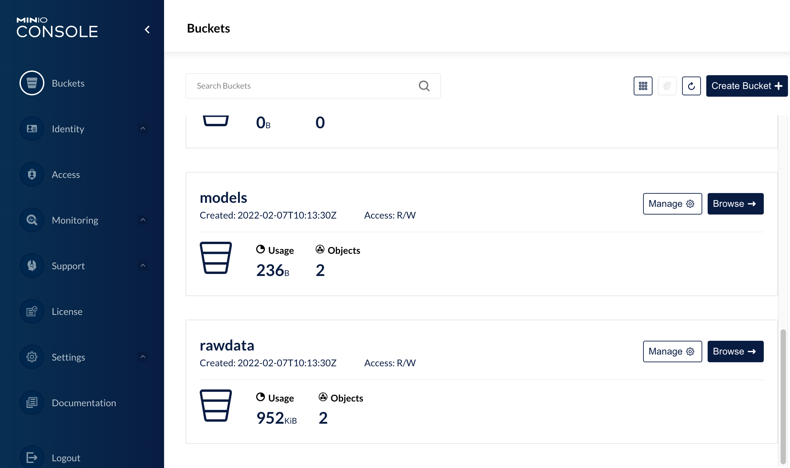
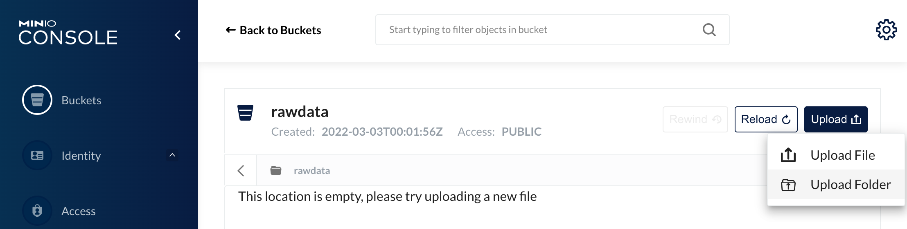

# Open Data Hub Workshop Setup Instructions

## Prerequisites
You'll need:
- An OpenShift 4.8 cluster - with admin rights. You can create one by following the instructions [here](http:/try.openshift.com), or via RHPDS (Red Hat staff only).
- the OpenShift command line interface, _oc_ available [here](https://docs.openshift.com/container-platform/4.6/cli_reference/openshift_cli/getting-started-cli.html)


## Workshop Structure


There are two versions of this workshop you can choose to use:
- an FSI Use Case
- a Telco use case
Both are functionally identical - but use different product data examples, applicable to the chosen use case. At various part of the workshop, you use different files approapiate to your chosen use case.

**<span style="color:yellow">REVISIT: This only has the FSI data files.<span>**

## Download the Workshop Files

If you are running this as a workshop, it is recommended you fork this repo as there are changes you can make to your instance of the repo, that will simplify the experience for the students. See section _Updating Tool URLs_ below.

Using the example below:   
1. Clone (or fork) this repo.
2. Change directory into the root dir, *_*ml-workshop*_*.  
3. Create a variable *REPO_HOME*_ for this directory

*<span style="color:yellow">REVISIT: Change to use a clone based on a tag/branch: 
git clone -b tag --single-branch https://github.com/odh-labs/ml-workshop.git<span>*

```
git clone https://github.com/odh-labs/ml-workshop.git
cd ml-workshop
export REPO_HOME=`pwd`
```

## Install the Open Data Hub Operator

1. Log on to OpenShift as a Cluster Administrator. (For RHPDS this is opentlc-mgr.)
2. Select the Administrator perspective
3. Install the Open Data Hub operator. Click **Operators > Operator Hub**  
   OpenShift displays the operator catalogue.  
4. Click the *Filter by keybord* text box and type *open data hub*  
   OpenShift displays the *Open Data Hub Operator* tile.
5. Click the tile  
   OpenShift displays a Commmunity Operator warning dialog box.
6. Click **Continue**  
   OpenShift displays the operator details.
7. Click **Install**   
   OpenShift prompts for the operator configuration details.   
     
8. Accept all defaults and click **Install*  
   OpenShift installs the operator and displays a diaglog box once complete.  
   
9. Click **View Operator**  
    OpenShift displays the operator details.   
     

The Open Data Hub Operator is now installed. Proceed to create the workshop project and install Open Data Hub

## Project Creation & ODH Installation Steps
We will now create the workshop's project and install Open Data Hub into the project.  
Before we do this we need to copy the Open Data Hub KfDef file that will instruct the operator which tools to install and how to configure them.

Later in these steps you will also need to:  
a. Edit the KfDef file you create in OpenShift with the URL of your cluster. Pay careful attention to those steps or Airflow will not run.  
b. Update the certificate for Airflow.

### Prerequisite Step:
Before installing Open Data Hub you need to copy the KFDef file from a oublic git repository.   

1. Using any editor of choice, open the KFDef File from the github repository your cloned. It is located in *./src/kfdef/workshop-kfdef.yaml*.
2. Copy the contents to the clipboard and keep it - you will use it shortly.

### Create the Workshop's Project and Install ODH
1. Create the **ml-workshop** project:  
   1.1 Click **Home > Projects**  
   1.2 Click the **Create Project** button on the top right of the screen  
   1.3 Click the **Name** text box and type  **ml-workshop**  
   1.4 Click **Create**  
   OpenShift creates the project.  
     
2. Delete the Limit Range for the project  
   2.1 Click **Administration > LimitRanges**  
   2.2 Click the hambuger button for the **ml-workshop-core-resource-limits**.   
     
   2.3 Click **Delete LimitRange**  
   OpenShift removes the LImitRange for the project.
2. Install Open Data Hub  
   2.1 Click **Operators > Installed Operators**  
   OpenShift displays all the operators currently installed.  

   <span style="color:yellow">**Note that the ml-workshop project is unselected and **All Projects** is selected. You must make ml-workshop the active project.**<span>  

   2.2 Click the **Projects** drop-down list and click **ml-workshop**  
     
   2.3 Click **Open Data Hub Operator**.  
   OpenShift displays the operator's details.  
     
   2.4 Click **Open Data Hub** in the operator toolbar.  
   OpenShift displays the operand details - of which there are none.   
     
   2.5 Click the **Create KfDef** button.  
   2.6 Click the **YAML View** radio button  
   OpenShift displays the KfDef YAML editor.  
     
   2.7 Replace the entire YAML file with the KfDef YAML you copied to your clipboard in the *Prerequisits* step above.  
   This KfDef file will tell OpenShift how to install and configure ODH.  
   Before you save the KfDef you must edit one line of code.  
   2.8 Locate the **airflow2** overlay in the code  
     
   Around line 57 you will see a **value** field that contains part of the URL to your OpenShift clister.  
   2.9 Replace the value with the the URI of **your** cluster from the *.apps* through to the *.com* as follows:   
```yaml
       - kustomizeConfig:
        overlays:
          - custom-image
        parameters:
          - name: OCP_APPS_URI
            # Change the line below to match your cluster URI. 
            # Using the URI from your OpenShift cluster, copy everything from .apps onwards
            # and replace the value below.
            value: .apps.rosa-5a98.ibhp.p1.openshiftapps.com
        repoRef:
          name: manifests
          path: ml-workshop-airflow2
```  
  2.10 Click **Create**  
       OpenShift creates the KfDef and proceeeds to deploy ODH.  
  2.11 Click **Workloads > Pods** to observe the deployment progress.  
        
      Be aweare this may take seveeralk minutes to complete.

## Installation Complete
The installation phase of Open Data Hub is now complete. Next you will configure the workshop environment.

--------------------------------------------------------------------------------------------------------

# Workshop Configuration

### Adding users to the workshop
If you are running ODH for a a workshop then you need to configure the users. If you are using the environment as a demo then you can jump forward to the **Configure Tools** section.

1. In a terminal window, type the following commands:
```
cd $REPO_HOME/scripts
./setup-users.sh
```


<span style="color:yellow">**Note: User configuration will invalidate any other logins like opentlc-mgr**.  
For cluster-admin access you should now use **user29**.<span>

If you need to create users with different credentials consult [this blog](https://medium.com/kubelancer-private-limited/create-users-on-openshift-4-dc5cfdf85661) - on which these instructions are based.

The password for all users is **openshift**.

--------------------------------------------------------------------------------------------------------

## Configure the S3 Storage

### Upload Files to the rawdata Bucket

In this section we will upload the files that will be used for feature engineering. The files are located in the **data-files** directory in the ml-workshop git project you cloned earlier.

1. Open the OpenShift console in your browser.
2. Click: **Networking > Routes**  

     

3. Scroll down to find *minio-ml-workshop-ui*. 
4. Click the Minio url under **Location** heading  
OpenShift opens a new browser tab and launches the Minio console and diaplays the login screen.   
   

5. Enter the following credentials:  
* Username: **minio**
* Password: **minio123**
6. Click **Login**  
Minio displays the main console and all of the existing S3 buckets.  
   

7. Scroll down to find the *rawdata* bucket.
8. Click **Browse**.  
Minio displays the bucket contents.  

You will now upload two folders (**customers** and **products**) to the *rawdata* bucket.

### Upload the *customers* data

9. Click: **Upload Files > Upload Folder**  

     

Minio prompts for the folder to upload.

10. Navigate to the data files directory within the git repository
  ```
  $REPO_HOME/data-files
  ```
11. Click the **customers** folder.   
    

11. Click: **Upload**.  
Minio uploads the folder and all file contents to the *raw data* S3 bucket.

12. Click the **Clean Complete Objects** button  to reveal the hidden upload controls. 

--------------------------------------------------------------------------------------------------------

## Configure Superset

Now you need to set up Superset to talk to our S3 and Kafka raw data via Trino - exposing the data via SQL.

1. Open the OpenShift console in your browser tab.  
     

2. Click the url for *superset*  
   OpenShift opens a new browser tab and displays the Superset login page.   
     

5. Enter the following credentials:   
* Username: **admin**   
* Password: **admin**   
6. Click **SIGN IN**  
   Superset diaplays the main console.  
     

7. Click: **Data > Databases**  
   Superset displays a list of configured databases.  
     

8. Click: the **"+ DATABASE"** button  
   Superset prompts for the database connection details
     

9. Click the **Supported Databases** drop-down list
10. Scroll down to the entry **Trino** and click it.
11. Copy and paste the following text into the **SQL Alchemy URI** text box:
```
trino://admin@trino-service:8080
```
12. Click **Test Connection**.  
If all steps have been performed correctly, Superset displays the message **Connection looks good!**.
     

13. Click the **Advanced** tab in the **Edit Database** form.  
Superset prompts for the advanced database configuration.   
     

14. Click **SQL Lab**.
15. Complete the form as illustrated in the following figure:  
     
16. Click **CONNECT** (or **FINISH** if you have done this step previously)
17. Click **SQL Lab Settings > Saved Queries** in the main toolbar.   
     

18. Click the **+ QUERY** button.

<span style="color:yellow">*NOTE: **DO NOT SAVE THE QUERY**. We don't save this as it only needs to be run once per workshop*</span>

19. Copy and paste the query editor:   
      ```
      CREATE TABLE hive.default.customers (
      customerId varchar,
      gender varchar,
      seniorCitizen varchar,
      partner varchar,
      dependents varchar,
      tenure varchar
      )
      WITH (format = 'CSV',
      skip_header_line_count = 1,
      EXTERNAL_LOCATION='s3a://rawdata/customers'
      )
      ```

20. Click **Run**.  
   Superset displays *Result - true* as shown.  
     

21. Replace the SQL command with:  
      ```
      SELECT customers.gender, customers.seniorcitizen, customers.partner, customers.dependents, customers.tenure, products.*  
      from hive.default.customers customers,
      customerchurn.default.data products
      where cast(customers.customerId as VARCHAR) = cast(products.customerId as VARCHAR)
      ```   
   Run the query as shown. You should see a resultset spanning personal and product consumption customer data.  
     

22. Click the *SAVE AS* button .   
Superset displays the Save As dialog box.
23. Click the **Name** text box. Replace the text with: **Kafka-CSV-Join**
24. Click the SAVE button.   
    Superset saves the query.

# Setup Complete

You are now done with setup!
